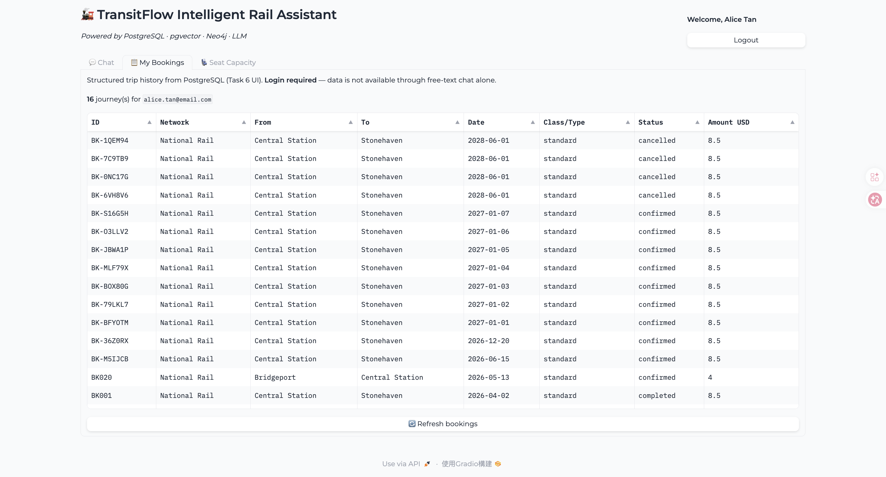
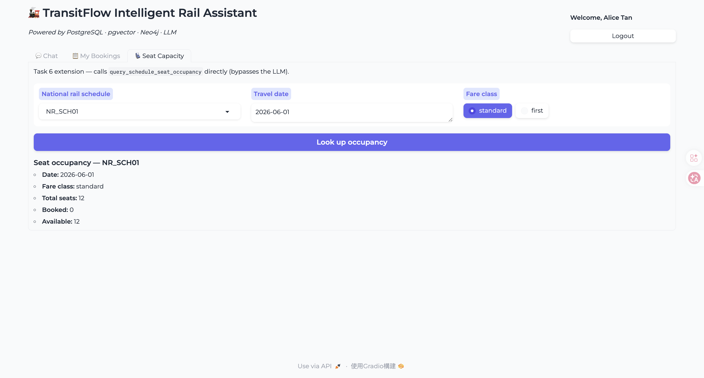
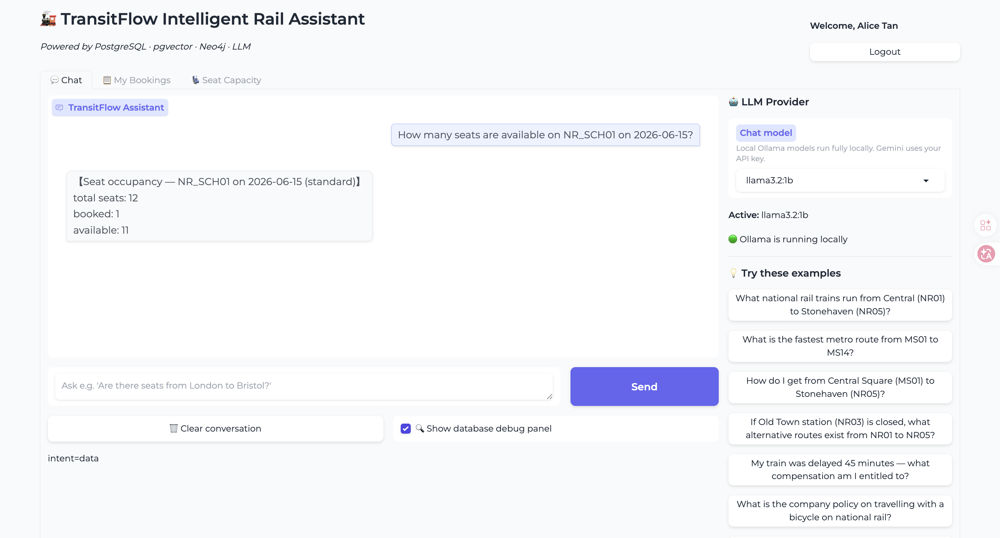

# Database Design Document — Team 113403504

TransitFlow final project design document (IM2002 Database Management).

---

## Section 1 — Entity-Relationship Diagram

### Overview

The relational layer models dual-network transit (metro + national rail), user accounts,
bookings, payments, and feedback. Graph routing and policy RAG live in Neo4j and pgvector
respectively; they are documented in Sections 3 and 4.

### ER diagram (core entities)

```mermaid
erDiagram
    users ||--|| user_credentials : "has"
    users ||--o{ user_security_questions : "has"
    users ||--o{ journeys : "creates"

    journeys ||--o| bookings : "national_rail"
    journeys ||--o| metro_trips : "metro"
    journeys ||--o| payments : "paid_by"

    national_rail_schedules ||--o{ national_rail_schedule_stops : "stops"
    national_rail_schedules ||--o{ national_rail_schedule_fares : "fares"
    national_rail_schedules ||--|| seat_layouts : "layout"
    seat_layouts ||--o{ coaches : "contains"
    coaches ||--o{ seats : "contains"

    bookings }o--|| national_rail_schedules : "on"
    bookings }o--|| national_rail_stations : "origin"
    bookings }o--|| national_rail_stations : "destination"
    bookings }o--|| seats : "reserved"

    metro_schedules ||--o{ metro_schedule_stops : "stops"
    metro_trips }o--|| metro_schedules : "on"

    users {
        varchar user_id PK
        varchar email UK
        date date_of_birth
        boolean is_active
    }
    journeys {
        varchar journey_id PK
        enum network
        enum status
        numeric amount_usd
    }
    bookings {
        varchar booking_id PK_FK
        varchar schedule_id FK
        date travel_date
        enum fare_class
    }
    national_rail_schedule_stops {
        varchar schedule_id PK_FK
        int stop_order PK
        varchar station_id FK
    }
```

### Cardinality notes

| Relationship | Cardinality | Rationale |
|--------------|-------------|-----------|
| users → journeys | 1:N | One user may have many trips over time |
| journeys → bookings | 1:1 | Booking id equals journey id (subtype) |
| schedule → schedule_stops | 1:N | Each schedule visits ordered stops |
| layout → seats | 1:N | One coach layout contains many seat rows |
| booking → seat | N:1 | Many bookings reference one physical seat on different dates |

---

## Section 2 — Normalisation Justification

### 3NF decision: schedule stops in junction tables

**Problem:** `metro_schedules.json` and `national_rail_schedules.json` embed stop lists
inside each schedule record. Storing stops as a PostgreSQL array would duplicate station
data and prevent FK integrity.

**Decision:** `metro_schedule_stops` and `national_rail_schedule_stops` with composite
PK `(schedule_id, stop_order)` and FK to station tables.

**Functional dependency:** `stop_order → station_id` is determined by `schedule_id`, not by
other non-key attributes — satisfies 3NF.

### 3NF decision: credentials separated from users

Password hashes and secret answers live in `user_credentials` and
`user_security_questions` rather than columns on `users`. This avoids repeating hash
metadata and allows independent rotation of credentials.

### Polymorphic journeys supertype

`payments` and `feedback` reference `journeys(journey_id)` instead of guessing BK vs MT
prefixes. `bookings` and `metro_trips` are 1:1 subtypes keyed by the same journey id.
This removes nullable FK columns and enforces id-pattern CHECK constraints.

### Password hashing: Argon2id

**Algorithm:** Argon2id via `argon2-cffi` (`skeleton/password_hash.py`).

**Why not MD5/SHA-256:** Course rubric requires adaptive hashing. SHA-family functions
are fast and unsuitable for passwords; identical passwords would also produce identical
hashes without salt stretching.

**Why Argon2id over bcrypt:** Argon2id balances side-channel resistance (hybrid mode)
and memory-hardness, which is the current OWASP recommendation for new systems.

**Salt management:** A unique 16-byte random salt per credential is stored in
`password_salt BYTEA`. The hash digest is stored separately in `password_hash TEXT`.
Login recomputes `hash_secret_raw(secret, salt, …)` and compares with
`secrets.compare_digest`. Two users with the same password therefore have different
stored hashes, defeating rainbow-table reuse.

### Deliberate de-normalisation

`bookings.stops_travelled` duplicates a value derivable from stop tables. We store it
to avoid joins at refund/cancellation time and to match mock JSON booking records. The
trade-off is acceptable because it is set once at booking insert inside the same
transaction.

---

## Section 3 — Graph Database Design Rationale

### What is stored where

| Graph element | Examples | Why |
|---------------|----------|-----|
| **Nodes** | `MetroStation`, `NationalRailStation` | Stations are entities queried by id/name |
| **Relationships** | `METRO_LINK`, `RAIL_LINK`, `INTERCHANGE_TO` | Track adjacency and transfer walking time |
| **Properties** | `time_weight`, `fare_weight`, `line` | Edge weights for Dijkstra / fare routing |

Station adjacency in PostgreSQL would require recursive CTEs or repeated self-joins for
multi-hop paths. Neo4j expresses variable-length traversal natively.

### Graph vs relational for routing

**Shortest path:** Implemented with `shortestPath` / APOC Dijkstra on weighted edges.
In SQL this would need a recursive CTE accumulating paths, which is harder to optimise
and reason about for cross-network hops.

**Delay ripple:** `query_delay_ripple` expands N hops via variable-length patterns — a
natural graph traversal. Modelling ripple in SQL would require pre-materialised adjacency
tables and repeated union queries per hop.

**Interchange:** `INTERCHANGE_TO` edges connect MS↔NR station pairs with walking time,
keeping metro and rail subgraphs separate but traversable.

### Node identity

Nodes are keyed by `station_id` (e.g. `MS01`, `NR03`) matching PostgreSQL and JSON mock
data. This gives stable cross-database joins and predictable agent tool parameters.

### Example queries enabled

1. **`query_shortest_route(MS01, MS14)`** — single-network time minimisation on `METRO_LINK`.
2. **`query_interchange_path(MS01, NR05)`** — must traverse `INTERCHANGE_TO` at Old Town /
   Central interchange nodes.

---

## Section 4 — Vector / RAG Design

### What is embedded

Policy content from `refund_policy.json`, `booking_rules.json`, `travel_policies.json`,
and `ticket_types.json` is chunked into `train-mock-data/policy_chunks.json` (59 chunks
on branch `113403501`). Each chunk is embedded into `policy_documents.embedding`.

### Why cosine similarity

Embeddings are high-dimensional direction vectors. Cosine similarity measures the angle
between query and document vectors, ignoring magnitude. Two policies with similar meaning
but different length therefore still rank highly — unlike L2 distance, which is biased
by vector norm.

### RAG pipeline

1. **User question** → agent rewrites policy queries (e.g. bicycle → “national rail bicycle foldable…”).
2. **Query embedding** → Ollama `nomic-embed-text` (768 dimensions).
3. **Similarity search** → `query_policy_vector_search` using pgvector `<=>` cosine distance with HNSW index.
4. **Retrieved chunk** → injected into rule-based answer or LLM fallback context.
5. **Answer** → agent returns top chunk text (JSON keyword fallback if vector DB empty).

### Embedding dimension and provider switch

We use **768-dim** vectors (Ollama default). Gemini embeddings use 3072-dim. Switching
provider after seeding without re-embedding causes dimension mismatch — inserts and index
scans fail. Re-run `python3 skeleton/seed_vectors.py` after any provider or dimension change.

---

## Section 5 — AI Tool Usage Evidence

### Example 1 — National rail availability direction filter

- **Context:** Implementing `query_national_rail_availability`; team was unsure whether to list reverse-direction trains.
- **Prompt:** “Implement query_national_rail_availability requiring origin stop_order < destination stop_order on national_rail_schedule_stops.”
- **Outcome:** AI generated SQL with `o_stop.stop_order < d_stop.stop_order`. We kept this after confirming README examples use from→to phrasing only. Correct for booking consistency.

### Example 2 — Policy chunk seeding

- **Context:** Task 3 RAG; teammate branch had `policy_chunks.json` but vectors were not seeded.
- **Prompt:** “After editing policy_chunks.json, run seed_vectors.py; ensure Ollama nomic-embed-text is pulled.”
- **Outcome:** 59 chunks embedded successfully. Agent bicycle/delay questions answered from pgvector instead of hallucinating.

### Example 3 — Agent closed-station bug (correction)

- **Context:** “Old Town station (NR03) is closed” was parsed as MS07 because name injection ran before avoid-station regex.
- **Prompt:** N/A — found via README test failure.
- **Outcome:** Added `_extract_avoid_station` prioritising explicit `(NR03)` in “station (NR03) is closed” patterns. Test now returns “No alternative route … avoiding NR03”.

### Example 4 — Password hashing rubric gap

- **Context:** Static code rubric requires Argon2/bcrypt; code used SHA-256 mock labelled argon2id.
- **Prompt:** “Replace _mock_hash with real argon2id in queries.py and seed_postgres.py.”
- **Outcome:** Created `skeleton/password_hash.py`; login/register/seed now use Argon2id.

---

## Section 6 — Reflection & Trade-offs

### Decision 1: VARCHAR business keys vs SERIAL

We use `user_id VARCHAR(10)` and `journey_id VARCHAR(20)` matching mock JSON (RU01, BK-XXXX).
**Reason:** Stable ids across PostgreSQL, agent, and demo scripts without a separate
surrogate key column. SERIAL would require an extra business-key column for every FK from JSON.

### Decision 2: Soft delete for bookings

Cancellations set `journeys.status = 'cancelled'` and `bookings.seat_occupies_slot = FALSE`
instead of DELETE. **Reason:** Preserves payment/refund audit trail and matches RF policy
windows that reference original booking amounts.

### Production differences

In production we would add: connection pooling (PgBouncer), schema migration tooling
(Flyway/Alembic), secrets in a vault (not `.env`), read replicas for availability queries,
and rate limiting on agent endpoints. Neo4j driver would use retry on defunct connections
after container restarts.

---

## Section 7 — Optional Extension (Task 6)

See **`TASK6.md`** for the file manifest.

### Motivation

Aggregated seat occupancy answers operational capacity questions without listing every seat row. A **My Bookings** table gives logged-in passengers persistent, scannable history — something ephemeral chat replies cannot provide.

### Database changes

No new tables. Extension function:

```python
pg.query_schedule_seat_occupancy("NR_SCH01", "2026-06-01", "standard")
# → total_seats, booked_seats, available_seats
```

SQL counts seats via `seat_layouts` → `coaches` → `seats`; available count delegates to `query_available_seats`.

### UI changes (substantial — Task 6 live demo)

| Tab | Data source | Purpose |
|-----|-------------|---------|
| **My Bookings** | `query_user_bookings(email)` | Dataframe of NR + metro journeys |
| **Seat Capacity** | `query_schedule_seat_occupancy(...)` | Dropdown schedule + date lookup without LLM |

### Testing evidence — screenshots

> **How to add:** Run `python3 skeleton/ui.py`, capture PNGs, save to `docs/screenshots/` (see that folder's README). Replace broken image icons below after saving files.

#### Screenshot 1 — My Bookings tab (login required)

**Steps:** Login `alice.tan@email.com` / `alice1990` → open **📋 My Bookings** → click **Refresh bookings**.

**Expected:** Dataframe with at least one National Rail and/or Metro row; note shows journey count for Alice.



#### Screenshot 2 — Seat Capacity tab (direct DB lookup)

**Steps:** Open **💺 Seat Capacity** → schedule `NR_SCH01`, date `2026-06-01`, class `standard` → **Look up occupancy**.

**Expected:** Markdown block showing total / booked / available seats (e.g. 18 total, 16 available).



#### Screenshot 3 — Chat agent seat question *(optional bonus evidence)*

**Steps:** **💬 Chat** tab → ask: *How many seats are available on NR_SCH01 on 2026-06-15?*

**Expected:** Agent returns formatted seat occupancy (total / booked / available).



### Automated test evidence (no screenshot needed)

```python
>>> pg.query_schedule_seat_occupancy("NR_SCH01", "2026-06-01", "standard")
{'schedule_id': 'NR_SCH01', 'travel_date': '2026-06-01', 'fare_class': 'standard',
 'total_seats': 18, 'booked_seats': 2, 'available_seats': 16}
```

Agent: *“How many seats are available on NR_SCH01 on 2026-06-15?”* → formatted occupancy block.

```bash
python3 skeleton/validate_integration.py   # Task 6 occupancy + agent — 0 failures
python3 skeleton/validate_rubric.py        # Live rubric B/C + Task 6 — 0 failures
python3 skeleton/validate_ui.py            # UI handlers + Gradio server — 0 failures
```

### Example queries & expected output

## EEClass Submission Checklist (Team)

| Deliverable | File / action |
|-------------|----------------|
| Public GitHub repo | `https://github.com/Ivy714/IM2002-DBMGT-Train-final` branch `113403504` |
| Design document | Upload `Team113403504_DESIGN_DOC.md` |
| Work allocation | **EEClass only** — upload `Team113403504_WORK_ALLOCATION.md`; **do not commit to GitHub** (contains personal data per course policy) |
| Peer review | Each member uploads own `Team113403504_<StudentID>_PEER_REVIEW.md` (confidential) |
| Live demo | Docker up + seeds + `python3 skeleton/ui.py` |
