# Database Design Document — Team 29

TransitFlow final project design document (IM2002 Database Management)

---

## Section 1 — Entity-Relationship Diagram

### 1.1 Overview

The relational database supports the structured part of TransitFlow, including users, authentication, stations, schedules, ordered stops, fare tables, seat inventory, journeys, national rail bookings, metro trips, payments, feedback, and policy documents for vector search.

The schema separates the two transport networks because their business rules are different:

- **Metro** supports same-day travel and does not use reserved seating.
- **National Rail** supports advance booking, fare classes, reserved seats, and seat availability checks.

The schema uses a shared `journeys` table as a transaction supertype. National rail journeys store their network-specific details in `bookings`, while metro journeys store their network-specific details in `metro_trips`. This allows `payments` and `feedback` to reference a single common journey identifier instead of using separate nullable foreign keys for metro trips and national rail bookings.

The `policy_documents` table is also stored in PostgreSQL. It supports the vector/RAG component through pgvector and is discussed further in Section 4.

---

### 1.2 Entity-Relationship Diagram

```mermaid
erDiagram
    users ||--o| user_credentials : "has credentials"
    users ||--o{ user_security_questions : "has recovery questions"
    users ||--o{ journeys : "creates"
    users ||--o{ feedback : "submits"

    ticket_types ||--o{ ticket_type_networks : "valid on networks"
    ticket_types ||--o{ journeys : "used by"

    journeys ||--o| bookings : "national rail detail"
    journeys ||--o| metro_trips : "metro detail"
    journeys ||--o{ payments : "has payments"
    journeys ||--o{ feedback : "receives feedback"
    journeys ||--o{ metro_trips : "day pass reference"

    metro_stations |o--o| national_rail_stations : "optional interchange"

    metro_stations ||--o{ metro_station_lines : "served by"
    national_rail_stations ||--o{ national_rail_station_lines : "served by"

    metro_schedules ||--o{ metro_schedule_stops : "has ordered stops"
    metro_stations ||--o{ metro_schedule_stops : "appears in"

    national_rail_schedules ||--o{ national_rail_schedule_stops : "has ordered stops"
    national_rail_stations ||--o{ national_rail_schedule_stops : "appears in"

    metro_schedules ||--o{ metro_schedule_operates_on : "operates on"
    national_rail_schedules ||--o{ national_rail_schedule_operates_on : "operates on"

    national_rail_schedules ||--o{ national_rail_schedule_fares : "has fare classes"
    national_rail_schedules ||--o| seat_layouts : "may have seat layout"

    seat_layouts ||--o{ coaches : "contains coaches"
    coaches ||--o{ seats : "contains seats"
    seats ||--o{ bookings : "reserved by"

    national_rail_schedules ||--o{ bookings : "used by"
    national_rail_stations ||--o{ bookings : "origin station"
    national_rail_stations ||--o{ bookings : "destination station"

    metro_schedules ||--o{ metro_trips : "used by"
    metro_stations ||--o{ metro_trips : "origin station"
    metro_stations ||--o{ metro_trips : "destination station"

    users {
        string user_id PK
        string first_name
        string last_name
        string email
        string phone
        date date_of_birth
        datetime registered_at
        boolean is_active
    }

    user_credentials {
        string user_id PK
        string password_hash
        string password_salt
        string hash_algorithm
        datetime created_at
        datetime updated_at
    }

    user_security_questions {
        string security_question_id PK
        string user_id FK
        string secret_question
        string secret_answer_hash
        string secret_answer_salt
        string hash_algorithm
        datetime created_at
        datetime updated_at
    }

    metro_stations {
        string station_id PK
        string name
        boolean is_interchange_metro
        boolean is_interchange_national_rail
        string interchange_national_rail_station_id FK
    }

    national_rail_stations {
        string station_id PK
        string name
        boolean is_interchange_national_rail
        boolean is_interchange_metro
        string interchange_metro_station_id FK
    }

    metro_station_lines {
        string station_id PK
        string line PK
    }

    national_rail_station_lines {
        string station_id PK
        string line PK
    }

    metro_schedules {
        string schedule_id PK
        string line
        string direction
        string origin_station_id FK
        string destination_station_id FK
        string first_train_time
        string last_train_time
        int frequency_min
        float base_fare_usd
        float per_stop_rate_usd
    }

    national_rail_schedules {
        string schedule_id PK
        string line
        string service_type
        string direction
        string origin_station_id FK
        string destination_station_id FK
        string first_train_time
        string last_train_time
        int frequency_min
    }

    national_rail_schedule_fares {
        string schedule_id PK
        string fare_class PK
        float base_fare_usd
        float per_stop_rate_usd
    }

    metro_schedule_stops {
        string schedule_id PK
        int stop_order PK
        string station_id FK
        int travel_time_from_origin_min
    }

    national_rail_schedule_stops {
        string schedule_id PK
        int stop_order PK
        string station_id FK
        int travel_time_from_origin_min
        boolean is_stopping
    }

    metro_schedule_operates_on {
        string schedule_id PK
        string day_of_week PK
    }

    national_rail_schedule_operates_on {
        string schedule_id PK
        string day_of_week PK
    }

    seat_layouts {
        string layout_id PK
        string schedule_id FK
    }

    coaches {
        string layout_id PK
        string coach PK
        string fare_class
    }

    seats {
        string layout_id PK
        string coach PK
        string seat_id PK
        int seat_row
        string seat_column
    }

    ticket_types {
        string ticket_type PK
        string display_name
        string description
    }

    ticket_type_networks {
        string ticket_type PK
        string network PK
    }

    journeys {
        string journey_id PK
        string network
        string user_id FK
        string ticket_type FK
        float amount_usd
        string status
    }

    bookings {
        string booking_id PK
        string schedule_id FK
        string origin_station_id FK
        string destination_station_id FK
        date travel_date
        string departure_time
        string fare_class
        string layout_id FK
        string coach FK
        string seat_id FK
        int stops_travelled
        datetime booked_at
        datetime travelled_at
        boolean seat_occupies_slot
    }

    metro_trips {
        string trip_id PK
        string schedule_id FK
        string origin_station_id FK
        string destination_station_id FK
        date travel_date
        string day_pass_ref FK
        int stops_travelled
        datetime purchased_at
        datetime travelled_at
    }

    payments {
        string payment_id PK
        string journey_id FK
        float amount_usd
        string method
        string status
        datetime paid_at
    }

    feedback {
        string feedback_id PK
        string journey_id FK
        string user_id FK
        int rating
        string comment
        datetime submitted_at
    }

    policy_documents {
        int id PK
        string chunk_id
        string title
        string category
        string document_type
        string policy_id
        string content
        string metadata
        string embedding
        string source_file
        datetime created_at
    }
```



---

### 1.3 Main Entity Groups

#### Users and authentication

The schema separates user profile data from authentication data.

- `users` stores profile information, including `first_name`, `last_name`, `email`, `phone`, `date_of_birth`, `registered_at`, and `is_active`.
- `user_credentials` stores password hashes, salts, and the hashing algorithm.
- `user_security_questions` stores security questions, hashed answers, salts, and the hashing algorithm.

This separation prevents plaintext passwords and plaintext security answers from being stored in the main user table. Passwords and security-question answers are hashed with Argon2id, which is discussed further in Section 2.

#### Stations and station lines

Metro and national rail stations are stored separately because they belong to different transport networks and have different schedule tables.

- `metro_stations` stores metro station information and an optional national rail interchange reference.
- `national_rail_stations` stores national rail station information and an optional metro interchange reference.
- `metro_station_lines` stores the metro lines served by each metro station.
- `national_rail_station_lines` stores the national rail lines served by each rail station.

The interchange relationship is optional because only some stations connect across networks.

#### Schedules and ordered stops

The schema separates schedules by network:

- `metro_schedules`
- `national_rail_schedules`

Each schedule has ordered stops:

- `metro_schedule_stops`
- `national_rail_schedule_stops`

The ordered stop tables are important because route direction depends on `stop_order`. A valid trip must have the origin stop before the destination stop.

For national rail, the `is_stopping` column distinguishes real stopping stations from express pass-through stations. This prevents pass-through stations from being used as valid boarding or alighting stations.

Operating days are also normalized into junction tables:

- `metro_schedule_operates_on`
- `national_rail_schedule_operates_on`

This avoids storing a list of operating days directly inside the schedule tables.

#### National rail fare classes and seat inventory

National rail fares are stored in:

```text
national_rail_schedule_fares
```

The primary key is:

```text
(schedule_id, fare_class)
```

This allows each schedule to have different fare rates for standard and first class.

Reserved seating is modeled with:

```text
seat_layouts
coaches
seats
```

A `seat_layouts` row belongs to one national rail schedule through `schedule_id`. Since `seat_layouts.schedule_id` is unique, a national rail schedule can have at most one seat layout.

Each layout contains coaches, and each coach contains physical seats. Coaches also store the `fare_class`, allowing the system to check whether a requested seat belongs to the correct fare class.

#### Journeys, bookings, and metro trips

The `journeys` table is a shared transaction supertype. It stores fields common to both networks:

```text
journey_id
network
user_id
ticket_type
amount_usd
status
```

Network-specific details are stored in subtype tables:

- `bookings` stores national rail booking details.
- `metro_trips` stores metro journey details.

The `journeys` table also enforces ID prefix consistency:

```text
MT% for metro journeys
BK% for national rail journeys
```

This design allows `payments` and `feedback` to reference `journeys(journey_id)` directly.

#### National rail bookings

The `bookings` table stores national rail-specific information, including:

```text
schedule_id
origin_station_id
destination_station_id
travel_date
departure_time
fare_class
layout_id
coach
seat_id
stops_travelled
seat_occupies_slot
```

The seat reference is a composite foreign key:

```text
(layout_id, coach, seat_id)
```

which points to:

```text
seats(layout_id, coach, seat_id)
```

This ensures that a booking can only reserve a seat that exists in the seat inventory.

The `seat_occupies_slot` field is used to distinguish active seat reservations from historical cancelled bookings. Cancelled bookings remain in the database, but they no longer block the seat.

#### Metro trips

The `metro_trips` table stores metro-specific trip data, including:

```text
schedule_id
origin_station_id
destination_station_id
travel_date
day_pass_ref
stops_travelled
purchased_at
travelled_at
```

Metro trips do not reference seats because the metro system does not use reserved seating.

The `day_pass_ref` field can reference a parent day-pass journey. It uses `ON DELETE SET NULL`, allowing related trip records to remain even if the referenced day-pass journey is removed.

#### Payments and feedback

`payments` references `journeys(journey_id)`, so the same payment table supports both metro and national rail transactions.

The key payment fields are:

```text
payment_id
journey_id
amount_usd
method
status
paid_at
```

`feedback` also references `journeys(journey_id)` and `users(user_id)`. It includes a unique constraint on `(journey_id, user_id)` so the same user cannot submit duplicate feedback for the same journey.

#### Policy documents

The `policy_documents` table stores embedded policy chunks for the vector/RAG component. It includes:

```text
chunk_id
title
category
document_type
policy_id
content
metadata
embedding
source_file
created_at
```

The table uses pgvector with a 768-dimensional embedding column and an HNSW cosine index. This supports semantic policy retrieval while keeping policy search separate from transactional booking data.

---

### 1.4 Cardinality Explanation

| Relationship | Cardinality | Explanation |
|---|---|---|
| `users` → `user_credentials` | 1 to 0..1 | A user may have one credential record. |
| `users` → `user_security_questions` | 1 to many | A user may have multiple security questions. |
| `users` → `journeys` | 1 to many | A user may create many journeys. |
| `ticket_types` → `ticket_type_networks` | 1 to many | A ticket type may be valid on one or more networks. |
| `ticket_types` → `journeys` | 1 to many | A ticket type can be used by many journeys. |
| `journeys` → `bookings` | 1 to 0..1 | A national rail journey may have one booking detail row. |
| `journeys` → `metro_trips` | 1 to 0..1 | A metro journey may have one metro trip detail row. |
| `journeys` → `payments` | 1 to many | A journey can have payment records. |
| `journeys` → `feedback` | 1 to many | A journey can receive feedback. |
| `journeys` → `metro_trips` through `day_pass_ref` | 1 to many | A day pass journey may be referenced by related metro trips. |
| `metro_stations` ↔ `national_rail_stations` | optional 1 to optional 1 | Some metro and national rail stations are connected by interchange references. |
| `metro_stations` → `metro_station_lines` | 1 to many | A metro station may serve multiple metro lines. |
| `national_rail_stations` → `national_rail_station_lines` | 1 to many | A rail station may serve multiple rail lines. |
| `metro_schedules` → `metro_schedule_stops` | 1 to many | A metro schedule contains ordered stops. |
| `national_rail_schedules` → `national_rail_schedule_stops` | 1 to many | A national rail schedule contains ordered stops. |
| `metro_schedules` → `metro_schedule_operates_on` | 1 to many | A metro schedule can operate on multiple days. |
| `national_rail_schedules` → `national_rail_schedule_operates_on` | 1 to many | A rail schedule can operate on multiple days. |
| `national_rail_schedules` → `national_rail_schedule_fares` | 1 to many | A rail schedule can have multiple fare classes. |
| `national_rail_schedules` → `seat_layouts` | 1 to 0..1 | A rail schedule may have at most one seat layout. |
| `seat_layouts` → `coaches` | 1 to many | A seat layout contains multiple coaches. |
| `coaches` → `seats` | 1 to many | A coach contains multiple physical seats. |
| `seats` → `bookings` | 1 to many over time | A seat can appear in many historical bookings, but only one active booking for the same schedule, travel date, departure time, coach, and seat. |

---

### 1.5 Important Constraints

The schema uses constraints to protect data correctness.

1. **Primary keys** identify all major entities, including users, stations, schedules, journeys, bookings, metro trips, payments, feedback, and policy documents.
2. **Foreign keys** preserve references between users, credentials, security questions, schedules, stops, stations, seats, journeys, payments, and feedback.
3. **Schedule stop order** supports direction-sensitive route and availability queries.
4. **National rail pass-through stations** are represented with `is_stopping = FALSE`.
5. **Ticket type validity** is normalized through `ticket_type_networks`, which prevents invalid network-ticket combinations at the data-model level.
6. **Journey ID prefix checks** enforce that metro journeys use `MT%` IDs and national rail journeys use `BK%` IDs.
7. **Seat inventory integrity** is enforced through the composite seat foreign key `(layout_id, coach, seat_id)`.
8. **Active seat uniqueness** is enforced with a partial unique index on active seat reservations, so cancelled bookings can remain in history while releasing the seat.
9. **Feedback uniqueness** is enforced with a unique constraint on `(journey_id, user_id)`.
10. **Policy retrieval data** is stored separately in `policy_documents`, so RAG search does not interfere with transactional booking integrity.

Overall, the ER design keeps transactional data normalized while supporting the different requirements of metro trips, national rail bookings, route lookup, reserved seating, payments, feedback, and policy retrieval.

---

## Section 2 — Normalisation Justification

### 2.1 Overview

The PostgreSQL schema was designed to keep the transactional part of TransitFlow mostly in Third Normal Form (3NF). The main goal was to avoid storing repeated lists or nested JSON structures directly inside relational tables. Instead, multi-valued attributes from the mock JSON files were decomposed into separate relation tables with primary keys, foreign keys, and uniqueness constraints.

This is especially important because the source mock data contains nested structures such as:

- station line arrays,
- schedule stop arrays,
- schedule operating-day arrays,
- national rail fare-class objects,
- seat layouts with coaches and seats,
- different transaction types for metro and national rail.

The relational schema converts these nested structures into normalized tables so that each fact is stored once, every non-key attribute depends on the key of its own table, and foreign keys can enforce referential integrity.

---

### 2.2 3NF Decision: Schedule Stops Stored in Separate Stop Tables

#### Problem

The mock schedule data contains ordered stop lists inside each schedule record. If those stops were stored as an array column inside `metro_schedules` or `national_rail_schedules`, the design would violate first normal form because the stop list would be a repeating group inside one row.

For example, a schedule has multiple stations, and each station has its own order and travel time from origin. Storing this as a single list would make it difficult to:

- enforce that each station exists in the station table,
- query trains serving a specific station,
- compare origin and destination stop order,
- prevent duplicate station appearances in the same schedule,
- calculate stops travelled using relational queries.

#### Implemented design

The schema decomposes schedule stops into separate tables:

```sql
metro_schedule_stops(
    schedule_id,
    station_id,
    stop_order,
    travel_time_from_origin_min
)

national_rail_schedule_stops(
    schedule_id,
    station_id,
    stop_order,
    travel_time_from_origin_min,
    is_stopping
)
```

Both stop tables use `(schedule_id, stop_order)` as the primary key. They also keep `station_id` as a foreign key to the relevant station table.

#### Functional dependency

For metro schedule stops, the relevant dependency is:

```text
(schedule_id, stop_order) → station_id, travel_time_from_origin_min
```

For national rail schedule stops, the relevant dependency is:

```text
(schedule_id, stop_order) → station_id, travel_time_from_origin_min, is_stopping
```

This means that the station at a specific position in a specific schedule is determined by the composite key. The non-key attributes depend on the whole key, not only part of the key.

This satisfies 2NF because there is no partial dependency on only `schedule_id` or only `stop_order`. It also satisfies 3NF because the non-key attributes do not depend on another non-key attribute.

#### Practical consequence

This design directly supports the implemented availability query. To find trains from an origin station to a destination station, the query can join the same stop table twice and enforce:

```sql
origin_stop.stop_order < destination_stop.stop_order
```

This makes direction-sensitive schedule lookup possible. A train is only valid if it serves both stations and the origin appears before the destination.

---

### 2.3 3NF Decision: Operating Days Stored in Junction Tables

#### Problem

The mock schedule data stores operating days as a list such as `["mon", "tue", "wed"]`. Storing these days as an array in the schedule table would create a multi-valued attribute.

That design would make it harder to filter schedules by a single weekday and would prevent the database from enforcing valid day values through a relational key.

#### Implemented design

The schema stores operating days in separate junction tables:

```sql
metro_schedule_operates_on(
    schedule_id,
    day_of_week
)

national_rail_schedule_operates_on(
    schedule_id,
    day_of_week
)
```

Each table uses `(schedule_id, day_of_week)` as the primary key.

#### Functional dependency

The relation represents one fact:

```text
(schedule_id, day_of_week) exists
```

There are no additional non-key attributes in these tables. This is a clean junction-table design because the table represents the many-to-many relationship between schedules and days of operation.

#### Normalisation benefit

This avoids a repeating group inside `metro_schedules` or `national_rail_schedules`. It also lets queries filter by weekday using a normal join instead of array parsing.

---

### 2.4 3NF Decision: National Rail Fare Classes Stored Separately

#### Problem

National rail schedules have multiple fare classes. In the mock data, each national rail schedule has fare-class information such as standard and first class. If these values were stored directly as columns in `national_rail_schedules`, the schema would become less flexible and would mix schedule identity with fare-class-specific data.

For example, this design would be weaker:

```text
national_rail_schedules(
    schedule_id,
    standard_base_fare,
    standard_per_stop_rate,
    first_base_fare,
    first_per_stop_rate
)
```

That structure hard-codes the fare classes into columns and repeats the same attribute pattern for each class.

#### Implemented design

The schema stores national rail fares in:

```sql
national_rail_schedule_fares(
    schedule_id,
    fare_class,
    base_fare_usd,
    per_stop_rate_usd
)
```

The primary key is:

```text
(schedule_id, fare_class)
```

#### Functional dependency

The dependency is:

```text
(schedule_id, fare_class) → base_fare_usd, per_stop_rate_usd
```

The fare rate is determined by both the schedule and the fare class. It is not determined by `schedule_id` alone, because the same schedule can have more than one fare class. It is also not determined by `fare_class` alone, because different schedules can have different fare rates.

This satisfies 2NF because `base_fare_usd` and `per_stop_rate_usd` depend on the full composite key. It also satisfies 3NF because there is no transitive dependency between non-key attributes.

#### Practical consequence

The implemented national rail fare query can calculate fare by joining on `schedule_id` and `fare_class`, then applying:

```text
total_fare = base_fare_usd + per_stop_rate_usd × stops_travelled
```

This keeps fare-class logic in relational data instead of hard-coding it in the application.

---

### 2.5 3NF Decision: Seat Layout Decomposition

#### Problem

National rail seat data is hierarchical:

```text
schedule → seat layout → coaches → seats
```

If all seat information were stored directly in `bookings`, the database would repeat coach and seat metadata every time a passenger made a reservation. That would create update anomalies. For example, if a coach layout changed, every related booking row would need to be checked or updated.

#### Implemented design

The schema decomposes seat inventory into:

```sql
seat_layouts(
    layout_id,
    schedule_id
)

coaches(
    layout_id,
    coach,
    fare_class
)

seats(
    layout_id,
    coach,
    seat_id,
    seat_row,
    seat_column
)
```

The `bookings` table then references a real seat using:

```sql
(layout_id, coach, seat_id)
```

#### Functional dependencies

The main dependencies are:

```text
layout_id → schedule_id
(layout_id, coach) → fare_class
(layout_id, coach, seat_id) → seat_row, seat_column
```

This design keeps coach-level attributes in `coaches` and seat-level attributes in `seats`. The booking row only stores the selected seat reference, not the full seat definition.

#### Normalisation benefit

This avoids repeating seat inventory data across many bookings. It also allows the database to enforce that a booking can only reserve a seat that exists in the seat inventory.

---

### 2.6 3NF Decision: Authentication Data Separated from User Profile Data

#### Problem

User profile data and authentication data have different security and update requirements. A passenger’s name, phone, and date of birth are profile attributes. Password hashes and security-answer hashes are sensitive authentication attributes.

If password fields were stored directly in `users`, the user table would mix general profile data with credential-management data. This would also make it harder to rotate credentials independently.

#### Implemented design

The schema separates these concerns:

```sql
users(
    user_id,
    first_name,
    last_name,
    email,
    phone,
    date_of_birth,
    registered_at,
    is_active
)

user_credentials(
    user_id,
    password_hash,
    password_salt,
    hash_algorithm,
    created_at,
    updated_at
)

user_security_questions(
    security_question_id,
    user_id,
    secret_question,
    secret_answer_hash,
    secret_answer_salt,
    hash_algorithm,
    created_at,
    updated_at
)
```

`user_credentials.user_id` is both the primary key and a foreign key to `users(user_id)`. This creates a one-to-zero-or-one relationship from users to credentials in the schema.

#### Functional dependencies

For `users`:

```text
user_id → first_name, last_name, email, phone, date_of_birth, registered_at, is_active
```

For `user_credentials`:

```text
user_id → password_hash, password_salt, hash_algorithm, created_at, updated_at
```

For `user_security_questions`:

```text
security_question_id → user_id, secret_question, secret_answer_hash, secret_answer_salt, hash_algorithm
```

Each table stores attributes that depend on its own key. This avoids mixing unrelated dependencies in a single table.

#### Normalisation benefit

Separating credentials from profiles reduces the risk of accidental exposure when querying user profile data. It also avoids update anomalies when authentication records change but profile data does not.

---

### 2.7 Supertype/Subtype Design for Journeys

#### Problem

The mock data contains two transaction types:

1. National rail bookings.
2. Metro travel history.

Both transaction types have common attributes such as user, ticket type, amount, and status. However, they also have different details:

- National rail bookings have fare class, departure time, coach, and seat.
- Metro trips have no reserved seat and may reference a day pass.

If `payments` and `feedback` referenced both `bookings` and `metro_trips` separately, the schema would need nullable foreign keys such as:

```text
payment.booking_id
payment.trip_id
```

That would create a polymorphic association problem. The database would need extra constraints to ensure exactly one of those columns is populated.

#### Implemented design

The schema uses `journeys` as a shared supertype:

```sql
journeys(
    journey_id,
    network,
    user_id,
    ticket_type,
    amount_usd,
    status
)
```

Network-specific details are stored in subtype tables:

```sql
bookings(
    booking_id,
    ...
)

metro_trips(
    trip_id,
    ...
)
```

Both `bookings.booking_id` and `metro_trips.trip_id` are primary keys that also reference `journeys(journey_id)`.

`payments` and `feedback` reference the common parent table:

```sql
payments.journey_id → journeys.journey_id
feedback.journey_id → journeys.journey_id
```

#### Functional dependency

For common journey data:

```text
journey_id → network, user_id, ticket_type, amount_usd, status
```

For national rail-specific booking data:

```text
booking_id → schedule_id, origin_station_id, destination_station_id, travel_date,
             departure_time, fare_class, layout_id, coach, seat_id,
             stops_travelled, booked_at, travelled_at, seat_occupies_slot
```

For metro-specific trip data:

```text
trip_id → schedule_id, origin_station_id, destination_station_id, travel_date,
          day_pass_ref, stops_travelled, purchased_at, travelled_at
```

The common attributes are stored once in `journeys`, and the subtype attributes are stored only in the relevant subtype table.

#### Normalisation benefit

This removes duplicated transaction columns from `bookings` and `metro_trips`. It also gives `payments` and `feedback` one consistent foreign key target.

---

### 2.8 Deliberate De-normalisation: `bookings.stops_travelled`

The main deliberate de-normalisation in the schema is:

```sql
bookings.stops_travelled
```

This value can be derived from the schedule stop table:

```text
destination_stop.stop_order - origin_stop.stop_order
```

Therefore, storing it in `bookings` duplicates a value that could be calculated by joining `bookings` to `national_rail_schedule_stops`.

#### Reason for storing it

The value is stored because it is part of the booking transaction at the time the booking is made. It is used for fare calculation, booking display, and cancellation/refund-related logic. Storing it also matches the mock booking records, where `stops_travelled` is already included.

#### Trade-off

The trade-off is that the value could become inconsistent if schedule stop orders were later changed. In this project, that risk is acceptable because schedules are treated as seeded reference data, while bookings are transactional records.

The value is inserted when the booking is created, after the system verifies the route order and calculates the number of stops. In other words, the stored value acts as a transaction snapshot rather than the only source of route truth.

---

### 2.9 Deliberate De-normalisation / Audit Trade-off: Cancelled Bookings Keep Seat History

The schema does not delete a booking row when a passenger cancels. Instead, cancellation changes the journey status and releases the seat slot through:

```sql
bookings.seat_occupies_slot = FALSE
```

The schema then uses a partial unique index:

```sql
CREATE UNIQUE INDEX idx_bookings_active_seat_unique
ON bookings (schedule_id, travel_date, departure_time, coach, seat_id)
WHERE seat_occupies_slot = TRUE;
```

#### Reason for this design

This keeps cancelled bookings as historical records while allowing the same physical seat to be booked again after cancellation.

#### Trade-off

This design stores historical booking rows that no longer occupy seats. A fully normalized inventory-only approach could delete or separate cancelled seat reservations, but that would lose auditability. For this project, keeping cancellation history is more important because payments, refunds, and feedback are linked to journey records.

---

### 2.10 Password Hashing Design

#### Algorithm used

The project uses **Argon2id** for password hashing. The implementation is in `skeleton/password_hash.py`, using:

```python
argon2.low_level.hash_secret_raw(..., type=Type.ID)
```

The same hashing function is used for:

- user passwords,
- security-question answers.

The stored fields are:

```sql
password_hash TEXT
password_salt BYTEA
hash_algorithm TEXT DEFAULT 'argon2id'
```

and for security answers:

```sql
secret_answer_hash TEXT
secret_answer_salt BYTEA
hash_algorithm TEXT DEFAULT 'argon2id'
```

#### Why Argon2id is preferred over MD5 or SHA-1

MD5 and SHA-1 are fast general-purpose hash functions. They are not suitable for password storage because attackers can compute large numbers of candidate hashes very quickly using GPUs or precomputed rainbow tables.

Argon2id is more appropriate for password hashing because it is an adaptive, memory-hard password hashing algorithm. The implementation uses configurable parameters such as:

```python
_TIME_COST
_MEMORY_COST
_PARALLELISM
_HASH_LEN
_SALT_LEN
```

This means the hash calculation intentionally requires more computation and memory than a simple MD5 or SHA-1 hash. That slows down brute-force attacks.

#### Salt management

Each password or secret answer uses a randomly generated salt:

```python
salt = os.urandom(_SALT_LEN)
```

The salt is stored separately in PostgreSQL as `BYTEA`.

The password verification process recomputes the Argon2id digest using the stored salt and compares the result with the stored hash using constant-time comparison:

```python
secrets.compare_digest(...)
```

This prevents two users with the same password from having the same stored hash. For example, if two users both choose the same password, the random salt makes their stored hash values different. This reduces the usefulness of rainbow-table attacks and prevents attackers from immediately identifying shared passwords by comparing hash strings.

---

### 2.11 Summary

The schema applies normalization mainly by decomposing nested JSON structures into relational tables:

- schedule stops are stored in stop tables instead of arrays,
- operating days are stored in junction tables,
- national rail fare classes are stored in a separate fare table,
- station line memberships are stored in line junction tables,
- seat inventory is decomposed into layouts, coaches, and seats,
- user credentials are separated from user profile data,
- shared transaction data is stored in `journeys` with `bookings` and `metro_trips` as subtypes.

The main deliberate de-normalisation is storing `bookings.stops_travelled` as a transaction snapshot. The schema also keeps cancelled booking rows for auditability while using `seat_occupies_slot` and a partial unique index to release seats for rebooking.

Password storage uses Argon2id with per-credential random salts, rather than fast hashes such as MD5 or SHA-1. This matches the security requirement for adaptive password hashing and protects against rainbow-table reuse.

---

## Section 3 — Graph Database Design Rationale

### 3.1 Overview

TransitFlow uses Neo4j for transport-network routing and disruption analysis. The relational database is suitable for structured booking data, payments, fares, users, and schedules, but route-finding is naturally graph-shaped. Stations are vertices, and physical connections between stations are edges.

The graph database is used for questions such as:

- What is the fastest route between two stations?
- What is the cheapest route between two stations?
- How can a passenger travel between the metro and national rail networks?
- What alternative route exists if a station is closed?
- Which nearby stations may be affected by a delay or disruption?

These operations require path traversal across connected stations. In Neo4j, this can be expressed directly as graph traversal over station nodes and relationship edges. The implemented graph layer is separate from the PostgreSQL transactional layer: Neo4j handles routing and connectivity, while PostgreSQL handles bookings, seats, payments, and policy vectors.

---

### 3.2 Graph Nodes

The Neo4j graph contains two station node labels:

```text
MetroStation
NationalRailStation
```

The project keeps metro and national rail stations as separate labels because the two networks have different station ID prefixes, line structures, fare assumptions, and interchange metadata.

#### MetroStation

`MetroStation` nodes are created from `metro_stations.json`.

Key properties include:

```text
station_id
name
lines
is_interchange_metro
interchange_metro_lines
is_interchange_national_rail
interchange_nr_station_id
base_fare_usd
per_stop_rate_usd
```

The `station_id` is the stable graph identity for each metro station. In the mock data, metro station IDs use the `MS` prefix, such as `MS01`.

Fare properties are stored on metro station nodes as graph-side defaults. They are used by the graph query layer when estimating route cost. The authoritative transactional fare calculation for bookings remains in PostgreSQL.

#### NationalRailStation

`NationalRailStation` nodes are created from `national_rail_stations.json`.

Key properties include:

```text
station_id
name
lines
is_interchange_national_rail
interchange_national_rail_lines
is_interchange_metro
interchange_metro_station_id
base_fare_standard_usd
per_stop_rate_standard_usd
base_fare_first_usd
per_stop_rate_first_usd
```

The `station_id` is the stable graph identity for each national rail station. In the mock data, national rail station IDs use the `NR` prefix, such as `NR01`.

National rail station nodes store standard and first-class fare defaults for route-cost estimation. The relational database still contains schedule-level fare data in `national_rail_schedule_fares`; the graph fare properties are used only for route projection and approximate cheapest-path calculations.

---

### 3.3 Graph Relationships

The graph uses three relationship types:

```text
METRO_LINK
RAIL_LINK
INTERCHANGE_TO
```

Each relationship represents a traversable connection between two station nodes.

#### METRO_LINK

`METRO_LINK` relationships connect adjacent metro stations.

Important relationship properties:

```text
line
travel_time_min
time_weight
fare_weight
```

`time_weight` is set from the travel time between adjacent metro stations. `fare_weight` is based on the per-stop metro fare rate. These properties allow the graph query layer to optimize routes either by travel time or by cost.

#### RAIL_LINK

`RAIL_LINK` relationships connect adjacent national rail stations.

Important relationship properties:

```text
line
travel_time_min
time_weight
fare_weight
```

`time_weight` is set from the travel time between adjacent national rail stations. `fare_weight` is based on the standard national rail per-stop fare rate. First-class fare projection is handled in the query result logic rather than through a separate relationship type.

#### INTERCHANGE_TO

`INTERCHANGE_TO` relationships connect metro stations and national rail stations where an interchange exists.

Important relationship properties:

```text
walking_time_min
time_weight
fare_weight
```

The graph seeding process creates interchange relationships in both directions:

```text
MetroStation → NationalRailStation
NationalRailStation → MetroStation
```

This bidirectional representation makes cross-network traversal possible without requiring the query to assume undirected semantics. The `time_weight` is set to the interchange walking time. The `fare_weight` is set to `0` because the interchange itself is not an additional ticketed segment in the graph model.

---

### 3.4 Node Identity Strategy

The graph uses `station_id` as the logical identity for station nodes.

Examples:

```text
MS01  = metro station
NR01  = national rail station
```

This matches the PostgreSQL station identifiers and the mock JSON data. The same station IDs are also used by the agent layer and the UI examples, which allows the system to pass station references consistently between:

- natural-language station parsing,
- PostgreSQL schedule queries,
- Neo4j route queries,
- UI/agent output formatting.

The graph query layer infers the network type from the station ID prefix:

```text
MS → metro
NR → national rail
```

This allows the query functions to decide whether a route is metro-only, rail-only, or cross-network.

---

### 3.5 Why a Graph Database Is Appropriate

A transport network is naturally represented as a graph:

```text
station → connection → station
```

In relational form, route-finding would require repeated self-joins or recursive common table expressions over station-connection tables. For a simple one-hop or two-hop query, SQL joins are manageable. However, shortest-route, cheapest-route, alternative-route, and cross-network traversal queries become more complex as the number of possible paths grows.

Neo4j is more appropriate for these tasks because it can traverse relationships directly. The graph model stores stations as nodes and travel connections as relationships, so pathfinding queries can operate on the network topology without reconstructing the graph from relational joins each time.

The implemented graph layer supports both unweighted and weighted routing:

- unweighted shortest-path fallback using `shortestPath`,
- weighted pathfinding using APOC Dijkstra when available,
- local fallback weighting if the weighted procedure is unavailable.

This is more suitable than relational recursive CTEs for the routing part of the project because the query intent is path traversal rather than record aggregation.

---

### 3.6 Pathfinding and Query Algorithms

#### Fastest route

The function `query_shortest_route(origin_id, destination_id, network="auto")` finds the fastest path between two stations.

The graph layer uses `time_weight` as the optimization property. The query first attempts weighted pathfinding through APOC Dijkstra. If that is unavailable, it falls back to an unweighted `shortestPath` and computes the path time locally from relationship weights.

Example query type:

```python
query_shortest_route("MS01", "MS14")
```

Expected purpose:

```text
Find the fastest route between two metro stations.
```

The returned result includes:

```text
found
origin_id
destination_id
total_time_min
path
legs
interchange_points
```

#### Cheapest route

The function `query_cheapest_route(origin_id, destination_id, network="auto", fare_class="standard")` finds a low-cost route using graph fare weights.

The graph layer uses `fare_weight` for path optimization. The final route projection computes a stops-based fare using the sequence of station IDs. Metro and national rail are charged as separate segments in the result logic.

Example query type:

```python
query_cheapest_route("NR01", "NR05", fare_class="standard")
```

Expected purpose:

```text
Find a route between two national rail stations while minimizing approximate travel cost.
```

This supports passenger questions where fare is more important than travel time.

#### Interchange path

The function `query_interchange_path(origin_id, destination_id)` handles cross-network routing between metro and national rail stations.

Example query type:

```python
query_interchange_path("MS01", "NR05")
```

Expected purpose:

```text
Find a path that crosses between metro and national rail using INTERCHANGE_TO.
```

The query requires the path to include at least one `INTERCHANGE_TO` relationship. This ensures that a cross-network answer explicitly includes an interchange point.

#### Alternative routes around a closed station

The function `query_alternative_routes(origin_id, destination_id, avoid_station_id, network="auto", max_routes=3)` finds routes that avoid a disrupted or closed station.

Example query type:

```python
query_alternative_routes("NR01", "NR05", "NR03")
```

Expected purpose:

```text
Find alternative routes from NR01 to NR05 while avoiding NR03.
```

The query excludes the avoided station from the path. The implementation repeatedly finds a path, records its station sequence, and then blocks intermediate nodes to search for a different route. This is appropriate for the small course graph and supports disruption-handling questions in the agent.

#### Delay ripple analysis

The function `query_delay_ripple(delayed_station_id, hops=2)` finds nearby stations that may be affected by a disruption.

Example query type:

```python
query_delay_ripple("MS01", hops=2)
```

Expected purpose:

```text
Find stations within two graph hops of a delayed station.
```

The result includes station identity, station name, number of hops away, affected lines, and network type. This supports operational questions about how a local disruption may affect nearby stations.

---

### 3.7 Graph Result Projection

The graph query layer does not return raw Neo4j objects directly to the UI. Instead, it converts paths into JSON-serializable Python dictionaries.

For each station node, the graph layer returns a normalized station structure:

```text
station_id
name
lines
network
```

For each relationship, the graph layer returns a leg structure:

```text
from_station_id
to_station_id
relationship
line
travel_time_min
```

For a complete route, the graph layer returns:

```text
found
origin_id
destination_id
total_time_min
total_fare_usd
path
legs
interchange_points
```

This projection is important because the conversational agent and UI need stable plain Python data structures, not Neo4j-native node or path objects.

---

### 3.8 Relationship Between Neo4j and PostgreSQL

Neo4j and PostgreSQL serve different roles in TransitFlow.

PostgreSQL is used for:

- user accounts,
- authentication,
- schedules,
- booking transactions,
- metro trips,
- national rail seat reservations,
- payments,
- feedback,
- policy document embeddings.

Neo4j is used for:

- fastest-route queries,
- cheapest-route queries,
- cross-network interchange routing,
- alternative routes around disruptions,
- delay ripple analysis.

This separation avoids forcing PostgreSQL to perform graph traversal and avoids forcing Neo4j to manage transactional booking constraints. For example, seat double-booking is enforced in PostgreSQL through relational constraints and a partial unique index, while route alternatives are handled in Neo4j through graph traversal.

---

### 3.9 Design Trade-offs

#### Duplicate station data

Station data exists in both PostgreSQL and Neo4j. PostgreSQL stores stations for relational schedule and booking integrity. Neo4j stores stations for route traversal.

This duplication is intentional. The two databases use the same `station_id` values so that the agent can move between relational and graph queries consistently. The trade-off is that both databases must be re-seeded from the same JSON source to remain synchronized.

#### Approximate graph fare projection

The graph database stores fare-related weights for cheapest-route estimation. However, exact fare calculation for national rail bookings belongs to PostgreSQL because national rail fare depends on schedule and fare class.

Therefore, graph fare values are used for route comparison and passenger-facing route estimates, not as the final transactional booking fare.

#### Weighted routing fallback

The graph layer attempts APOC Dijkstra for weighted routing. If APOC is unavailable, it falls back to a shortest-path search and local weight calculation. This makes the project more robust in different local environments, but the fallback is less precise for weighted optimization because it first selects a path by hop count before calculating the weight.

---

### 3.10 Summary

The graph database design models the transport network as stations connected by weighted relationships. The design uses:

- `MetroStation` and `NationalRailStation` nodes,
- `METRO_LINK`, `RAIL_LINK`, and `INTERCHANGE_TO` relationships,
- `time_weight` for fastest-route queries,
- `fare_weight` for cheapest-route queries,
- `station_id` as the stable node identity shared with PostgreSQL.

Neo4j is used because route finding, interchange traversal, disruption avoidance, and delay ripple analysis are graph traversal problems. These tasks are easier and clearer in a graph database than in relational SQL using repeated joins or recursive CTEs. PostgreSQL remains responsible for transactional integrity, while Neo4j is responsible for network traversal.

---

## Section 4 — Vector / RAG Design

### 4.1 Overview

TransitFlow uses a Retrieval-Augmented Generation (RAG) design for policy-related questions. The goal is to answer passenger questions about refunds, booking rules, ticket rules, delay compensation, bicycles, pets, luggage, and other travel policies using the project’s official mock policy data instead of relying only on the LLM’s general knowledge.

The RAG layer is stored in PostgreSQL using pgvector. The transactional database tables handle bookings, trips, payments, users, and schedules, while the vector table stores embedded policy chunks for semantic search.

The main RAG table is:

```sql
policy_documents
```

This table stores policy text chunks, metadata, and embedding vectors. The conversational agent uses this table when a user asks policy-related questions.

---

### 4.2 Documents Embedded

The embedded content comes from the project’s policy and rule data. The pre-processed chunk file is:

```text
train-mock-data/policy_chunks.json
```

The chunks are generated from policy-related source files such as:

```text
refund_policy.json
booking_rules.json
travel_policies.json
ticket_types.json
```

The uploaded `policy_chunks.json` contains structured chunk records with fields such as:

```text
chunk_id
source_file
document_type
title
content
metadata
```

Examples of embedded policy topics include:

- metro single-ticket refund rules,
- metro day-pass refund rules,
- national rail normal-service cancellation windows,
- national rail express-service cancellation windows,
- delay compensation rules,
- national rail advance booking rules,
- national rail seat-selection rules,
- metro ticket-change rules,
- bicycle policies,
- luggage policies,
- pet policies,
- prohibited item policies.

Each chunk is written as natural-language policy text rather than raw JSON only. This improves retrieval quality because user questions are also natural language.

---

### 4.3 Chunk Design

The chunking strategy is policy-aware rather than using arbitrary fixed-size text splitting.

Each chunk is centred on a specific policy concept, rule, or sub-rule. For example:

```text
refund_policy_RF001_W1
refund_policy_RF001_W2
refund_policy_RF005_RF005_R1
booking_rules_national_rail_advance_booking
travel_policies_metro_bicycles
```

This design keeps each retrieved chunk focused. For example, a question about a 45-minute train delay should retrieve the RF005 delay-compensation chunk rather than an unrelated cancellation-refund chunk.

Each chunk includes:

```text
content
metadata
```

The `content` field is what gets embedded. The `metadata` field stores structured information such as:

```text
policy_id
network_type
service_type
topic
rule_id
rule_type
ticket_type
json_path
related_policy_ids
```

This metadata is useful for debugging, filtering, and explaining which original rule the retrieved answer came from.

---

### 4.4 Vector Table Design

The RAG data is stored in PostgreSQL in the `policy_documents` table.

The table stores both human-readable policy fields and vector-search fields:

```sql
policy_documents(
    id,
    chunk_id,
    title,
    category,
    document_type,
    policy_id,
    content,
    metadata,
    embedding,
    source_file,
    created_at
)
```

The important fields are:

| Field | Purpose |
|---|---|
| `chunk_id` | Stable identifier for each policy chunk. |
| `title` | Human-readable title for retrieved results. |
| `category` | General category used by the application. |
| `document_type` | More specific source type, such as refund policy, booking rule, or travel policy. |
| `policy_id` | Policy identifier when available, such as `RF005`. |
| `content` | Natural-language text embedded and shown in retrieved answers. |
| `metadata` | JSONB metadata copied from `policy_chunks.json`. |
| `embedding` | pgvector embedding used for similarity search. |
| `source_file` | Original JSON policy source file. |

The seeding script also ensures supporting columns and indexes exist before inserting documents.

---

### 4.5 Embedding Model and Dimension Choice

The default local embedding provider is Ollama with:

```text
nomic-embed-text
```

The configured embedding dimension for Ollama is:

```text
768
```

This matches the PostgreSQL vector column used by the project:

```sql
vector(768)
```

The project also supports Gemini as an alternative provider. In `skeleton/config.py`, the configured Gemini embedding dimension is:

```text
3072
```

This means the embedding provider and the database vector dimension must match. If the project is seeded with Ollama embeddings, then query-time embeddings must also use the same Ollama embedding dimension. If the project switches to Gemini embeddings, the vector schema/index must be compatible with Gemini’s 3072-dimensional vectors and the vector table must be re-seeded.

The project’s `llm_provider.py` explicitly separates the chat provider from the embedding provider. Runtime chat-provider switching does not automatically change the embedding provider used for vector search. This protects the RAG layer from accidentally comparing embeddings generated by different models.

---

### 4.6 Vector Seeding Workflow

The vector seeding process is implemented in:

```text
skeleton/seed_vectors.py
```

The workflow is:

1. Ensure the `policy_documents` table has the required policy metadata columns.
2. Load policy chunks from `train-mock-data/policy_chunks.json`.
3. For each chunk, embed the chunk’s `content`.
4. Check that the returned embedding length matches the active provider’s expected dimension.
5. Store the policy document through `store_policy_document`.
6. Upsert by `chunk_id`, so re-running the seeder can refresh existing chunks.

The process can be summarized as:

```text
policy_chunks.json
        ↓
load each chunk
        ↓
llm.embed(chunk["content"])
        ↓
validate embedding dimension
        ↓
store_policy_document(...)
        ↓
policy_documents table
```

The seeding script is intended to be re-run when:

- policy JSON data changes,
- `policy_chunks.json` changes,
- the embedding provider changes,
- the embedding model changes.

This is necessary because embeddings are model-specific. A vector produced by one embedding model is not directly comparable to a vector produced by another embedding model.

---

### 4.7 Retrieval Workflow

When a user asks a policy-related question, the agent attempts vector retrieval first.

The retrieval flow is:

```text
user policy question
        ↓
optional query rewrite for policy-specific wording
        ↓
llm.embed(query)
        ↓
query_policy_vector_search(embedding)
        ↓
retrieve top matching policy chunks from policy_documents
        ↓
format retrieved policy content
        ↓
return grounded answer to user
```

The agent contains policy-specific routing logic. For example, if a user asks about bicycles, pets, luggage, refunds, delay compensation, or policy rules, the agent directs the question toward the policy lookup path.

For some policy categories, the agent rewrites the user query before embedding. For example, a bicycle question may be rewritten to include whether the user is asking about metro or national rail. This improves retrieval because the policy chunks distinguish between network-specific rules.

---

### 4.8 Similarity Search

The project uses cosine-similarity search through pgvector.

The vector-search settings are configured in `skeleton/config.py`:

```python
VECTOR_TOP_K = 3
VECTOR_SIMILARITY_THRESHOLD = 0.5
```

This means the system retrieves a small number of high-ranking chunks rather than returning a large set of loosely related policy records.

Cosine similarity is appropriate here because policy search is based on semantic meaning rather than exact keyword overlap. For example, a user may ask:

```text
Can I get money back if my train is late?
```

The exact phrase may not appear in the JSON file, but it is semantically close to:

```text
delay compensation
late train refund
refund for delay
```

Vector search helps retrieve the relevant RF005 delay-compensation policy even when the user does not use the exact policy wording.

---

### 4.9 JSON Fallback for Deterministic Policy Answers

The project also includes a deterministic JSON fallback in:

```text
skeleton/policy_lookup.py
```

This fallback searches official mock JSON policy files directly when vector retrieval is unavailable or when a deterministic rule is safer.

This is especially useful for policy questions with exact thresholds. For example, delay compensation has clear minute ranges:

```text
30–59 minutes
60–119 minutes
120+ minutes
```

For a question such as:

```text
My train was delayed 45 minutes — what compensation am I entitled to?
```

the agent can use the exact RF005 rule from JSON rather than relying only on semantic ranking.

This fallback makes the RAG system more robust because it avoids a failure mode where the nearest vector chunk is semantically similar but not the exact threshold rule needed for the answer.

---

### 4.10 RAG Answer Formatting

The agent formats retrieved policy chunks into a concise answer. A retrieved document normally includes:

```text
title
content
similarity
```

The formatted answer uses the retrieved policy title and policy content. The similarity score may also be displayed for debugging or transparency.

The answer is grounded in project data because it is generated from:

1. `policy_chunks.json`,
2. `policy_documents`,
3. deterministic JSON policy fallback when needed.

The LLM is not used as the sole source of truth for policy rules. It is used to embed the query and, when needed, to produce natural-language output around retrieved content.

---

### 4.11 Provider Switching and Re-seeding Requirement

The project supports two LLM providers:

```text
Ollama
Gemini
```

The default local provider is Ollama. Gemini is available when a Gemini API key is configured.

However, provider switching creates an important vector-dimension issue:

| Provider | Embedding model | Dimension |
|---|---|---:|
| Ollama | `nomic-embed-text` | 768 |
| Gemini | `gemini-embedding-001` | 3072 |

Because pgvector columns and indexes depend on vector dimensionality, embeddings from these providers are not interchangeable.

Therefore:

```text
If the embedding provider changes, seed_vectors.py must be re-run.
```

If the database was seeded with 768-dimensional Ollama vectors, it cannot correctly compare those stored vectors against 3072-dimensional Gemini vectors. The embedding model used for query-time retrieval must match the embedding model used during seeding.

---

### 4.12 Why RAG Is Used Instead of Plain LLM Answers

Policy questions require grounded answers. A plain LLM response may be fluent but may invent refund windows, ticket rules, or travel restrictions that do not exist in the project data.

RAG reduces this risk by retrieving policy text from the project’s own data before answering. This is important for questions such as:

- refund eligibility,
- delay compensation,
- seat-selection rules,
- bicycle restrictions,
- pet rules,
- metro ticket validity,
- national rail booking deadlines.

The final answer is therefore based on the mock policy documents, not on general real-world transit assumptions.

---

### 4.13 Summary

The vector/RAG layer stores embedded policy chunks in PostgreSQL using pgvector. The embedded source is `policy_chunks.json`, which is derived from the project’s official policy JSON files.

The design uses:

- policy-aware chunks,
- metadata-rich document records,
- Ollama `nomic-embed-text` embeddings by default,
- 768-dimensional vectors for the default local setup,
- cosine similarity for semantic retrieval,
- a deterministic JSON fallback for exact policy rules,
- re-seeding when the embedding provider or model changes.

This design allows TransitFlow to answer natural-language policy questions using the project’s own data while keeping structured booking operations in relational tables and route traversal in Neo4j.

---

## Section 5 — AI Tool Usage Evidence

### 5.1 Overview

AI tools were used as development assistants during the TransitFlow project. The team used AI mainly to support implementation review, query design, debugging, and documentation consistency. AI was not treated as the final authority. All generated suggestions were checked against the actual project files, mock data, schema, and working code.

To make AI-assisted work more consistent, the team also maintained an `AI_SESSION_CONTEXT.md` file. This file summarized the project architecture, coding conventions, relational schema, graph schema, implemented function signatures, team decisions, and prompts that produced useful results. The purpose was to reduce ambiguity when using AI in later coding sessions and to prevent generated code from using table names, function names, or design assumptions that did not match the actual project.

The most useful AI support occurred in the following areas:

1. designing direction-correct national rail availability queries,
2. preparing pgvector-ready policy chunks for RAG,
3. keeping AI coding sessions consistent through a shared session-context file,
4. correcting overly broad or inaccurate AI assumptions against the actual schema,
5. improving password hashing and authentication safety,
6. developing the Task 6 seat-occupancy extension.

---

### 5.2 Example 1 — National Rail Availability Query

#### Context

National rail schedules contain ordered stops. A train should only be returned if the origin station appears before the destination station in the same schedule. It is not enough to check that both stations appear somewhere on the same route, because that could return a reverse-direction service.

The team decision recorded in `AI_SESSION_CONTEXT.md` states:

```text
National rail direction: o_stop.stop_order < d_stop.stop_order
```

This rule was important because the project requires direction-sensitive schedule lookup.

#### Prompt

The AI session context records the following working prompt:

```text
Implement query_national_rail_availability using _connect() and RealDictCursor.
Require origin stop_order < destination stop_order on national_rail_schedule_stops.
```

#### Outcome

The final implementation of `query_national_rail_availability` joins `national_rail_schedule_stops` twice:

```text
o_stop = origin stop
d_stop = destination stop
```

It then enforces:

```sql
o_stop.stop_order < d_stop.stop_order
```

The query also requires both origin and destination to be stopping stations:

```sql
is_stopping = TRUE
```

This prevents express pass-through stations from being incorrectly returned as valid boarding or alighting stations.

The final query also calculates:

```text
stops_travelled
booked_seats
available_seats
```

#### Result in the final project

This AI-assisted work helped produce a PostgreSQL query that correctly supports national rail availability. The final result respects route direction, filters by travel date when provided, excludes non-stopping pass-through stations, and returns seat availability information.

---

### 5.3 Example 2 — RAG Policy Chunk Preparation

#### Context

TransitFlow includes policy data from JSON files such as refund policies, booking rules, travel policies, and ticket types. These policies are used to answer natural-language questions about refunds, delay compensation, bicycle rules, pet rules, luggage limits, ticket validity, and booking restrictions.

Embedding raw JSON files directly would make retrieval less precise because each file contains many different policy topics. For example, a question about a 45-minute delay should retrieve the specific RF005 delay-compensation rule, not an unrelated cancellation rule.

#### Prompt

The AI session context records the following working prompt:

```text
Generate pgvector-ready policy_chunks.json from booking_rules, refund_policy,
travel_policies, ticket_types — one topic per chunk with chunk_id and metadata.
```

#### Outcome

The final project uses:

```text
train-mock-data/policy_chunks.json
```

Each chunk has a focused policy topic and includes fields such as:

```text
chunk_id
source_file
document_type
title
content
metadata
```

Examples of final chunk IDs include:

```text
refund_policy_RF003
refund_policy_RF004
refund_policy_RF001_W1
refund_policy_RF005_RF005_R1
booking_rules_national_rail_advance_booking
travel_policies_metro_bicycles
travel_policies_national_rail_bicycles
```

The chunks also preserve metadata such as:

```text
policy_id
network_type
service_type
topic
rule_id
rule_type
ticket_type
json_path
related_policy_ids
```

#### Result in the final project

The final RAG design embeds pre-chunked policy records instead of embedding full raw JSON files at query time. This makes policy retrieval more precise and easier to debug.

The vector seeding workflow is implemented in:

```text
skeleton/seed_vectors.py
```

The session context also records the operational command:

```text
After editing policy_chunks.json, run: python3 skeleton/seed_vectors.py
(Ensure Ollama is running: ollama pull nomic-embed-text)
```

This became part of the team’s repeatable workflow for updating the vector store.

---

### 5.4 Example 3 — AI Session Context for Consistent Code Generation

#### Context

During the project, the team used AI multiple times for code review, query generation, debugging, and design-document drafting. Without a shared context file, AI output could easily become inconsistent with the project’s actual schema or naming conventions.

For example, an AI tool might invent a table name, assume a different foreign key structure, or use a function signature that does not exist in the repository.

#### AI-assisted workflow

The team maintained:

```text
AI_SESSION_CONTEXT.md
```

This file was designed to be pasted at the start of AI coding sessions so generated code would follow the team’s contracts.

The file records:

```text
Project Overview
Tech Stack
Coding Conventions
Agreed Relational Schema
Agreed Graph Schema
Function Signatures
Team Decisions Log
Prompts That Worked
```

It also states important project contracts, including:

```text
PostgreSQL = structured transit/booking/payment
Neo4j = routing
pgvector = policy RAG
```

and:

```text
Agent: rule-based handlers first; LLM fallback only when no DB match.
```

#### Outcome

The context file helped keep future AI-generated suggestions aligned with the actual implementation. It documented that the relational schema contains:

```text
users
user_credentials
user_security_questions
journeys
bookings
metro_trips
payments
feedback
policy_documents
```

It also documented that the graph schema contains:

```text
MetroStation
NationalRailStation
METRO_LINK
RAIL_LINK
INTERCHANGE_TO
```

#### Result in the final project

This file became an internal quality-control tool for AI usage. It reduced the risk of inconsistent naming, incorrect table assumptions, or unsupported architectural changes when asking AI for help.

---

### 5.5 Example 4 — Correcting AI Output Against the Actual Schema

#### Context

AI-generated design explanations can be too broad or too absolute if they are not checked against the actual schema. During documentation and review, the team needed to ensure that the written design matched the implemented database exactly.

One important correction involved the relationship between:

```text
national_rail_schedules
seat_layouts
```

A careless ERD description might say that every national rail schedule has exactly one seat layout. However, the schema only guarantees that one schedule can have at most one layout because `seat_layouts.schedule_id` is unique. The schema does not force every schedule to have a seat layout row.

#### Incorrect assumption

The overly broad version was:

```text
Every national rail schedule has exactly one seat layout.
```

#### Correction

The precise version is:

```text
A national rail schedule may have at most one seat layout.
A seat layout belongs to one national rail schedule.
```

In ERD cardinality, this should be represented as:

```text
national_rail_schedules ||--o| seat_layouts : "may have seat layout"
```

#### Outcome

This correction shows that AI output was not accepted blindly. The team checked wording against the actual schema and changed the design document to avoid claiming constraints that the database does not enforce.

#### Result in the final project

The final documentation uses more precise language for optional and unique relationships. This makes the design document better aligned with the implemented schema and avoids overstating what the database guarantees.

---

### 5.6 Example 5 — Agent Routing and Closed-Station Handling

#### Context

The conversational agent uses rule-based handlers before falling back to the LLM. This design decision is recorded in the AI session context:

```text
Agent: rule-based handlers first; LLM fallback only when no DB match.
```

This is important because many user questions should be answered by database queries, not by a general LLM response.

One route-related use case is a closed-station question such as:

```text
If Old Town station (NR03) is closed, what alternative routes exist from NR01 to NR05?
```

The system needs to identify the avoided station and call the Neo4j alternative-route logic.

#### AI-assisted issue review

During debugging, the team reviewed station extraction and avoid-station logic to ensure explicit station IDs were preferred over inferred station names.

A representative prompt for this type of review was:

```text
Inspect the agent station parsing logic for closed-station questions.
When the user explicitly writes a station ID such as NR03, the parser should prefer that ID over station-name inference.
```

#### Outcome

The final agent contains `_extract_avoid_station`, which checks explicit closed-station patterns before falling back to other station IDs. It handles cases such as:

```text
station (NR03) is closed
NR03 is closed
closed NR03
```

The agent then calls graph routing logic for alternative routes.

#### Result in the final project

This improved the reliability of closed-station route questions. It also reflects the team’s general agent design: deterministic parsing and database/graph tools are preferred before LLM fallback.

---

### 5.7 Example 6 — Password Hashing Review

#### Context

The project stores user credentials and security-question answers. These values should not be stored as plaintext. They also should not use fast general-purpose hash functions such as MD5 or SHA-1.

The AI session context records the coding convention:

```text
Passwords: Argon2id via skeleton/password_hash.py
```

#### AI-assisted review

A representative prompt for this review was:

```text
Review the authentication design. Passwords and security-question answers must not be stored in plaintext. Recommend a secure password hashing approach with per-user salts and verification logic.
```

#### Outcome

The final project uses Argon2id in:

```text
skeleton/password_hash.py
```

The implementation uses:

```python
argon2.low_level.hash_secret_raw(..., type=Type.ID)
```

Each password or security answer receives a random salt:

```python
salt = os.urandom(_SALT_LEN)
```

The stored credential fields include:

```text
password_hash
password_salt
hash_algorithm
```

Security-question answers use corresponding fields:

```text
secret_answer_hash
secret_answer_salt
hash_algorithm
```

Verification recomputes the Argon2id hash using the stored salt and compares it with the stored hash using constant-time comparison:

```python
secrets.compare_digest(...)
```

#### Result in the final project

The final implementation uses salted Argon2id hashes for both passwords and security-question answers. This is stronger than plaintext storage or fast hashes such as MD5/SHA-1.

---

### 5.8 Example 7 — Task 6 Seat Occupancy Extension

#### Context

The optional Task 6 extension added seat-occupancy analytics and UI support. The goal was to answer questions such as:

```text
How many standard seats are available on NR_SCH01 on 2026-06-15?
```

The existing booking system already handled available seat lists, but the Task 6 extension required an aggregated view:

```text
total seats
booked seats
available seats
```

The AI session context records the implemented function signature:

```text
query_schedule_seat_occupancy(schedule_id, travel_date, fare_class)
```

#### AI-assisted task

A representative prompt for this extension was:

```text
Add a Task 6 database operation that returns seat occupancy for a national rail schedule, travel date, and fare class. It should return total seats, booked seats, and available seats, and it should reuse the existing active-booking logic.
```

#### Outcome

The final Task 6 implementation is documented in:

```text
TASK6.md
```

The modified or added files include:

```text
databases/relational/queries.py
skeleton/agent.py
skeleton/ui.py
skeleton/validate_integration.py
TASK6.md
Team29_DESIGN_DOC.md
```

The new database operation is:

```text
query_schedule_seat_occupancy(schedule_id, travel_date, fare_class)
```

It returns:

```text
total_seats
booked_seats
available_seats
```

The UI exposes the feature through:

```text
My Bookings tab
Seat Capacity tab
```

The agent also supports natural-language seat-capacity questions when the user includes a national rail schedule ID, travel date, and seat-related wording.

#### Result in the final project

This feature extends the booking system from individual seat lookup to aggregate capacity reporting. It is useful for both passenger-facing questions and UI demonstration during evaluation.

---

### 5.9 Reflection on AI Tool Use

AI was useful for generating first-pass query patterns, reviewing schema decisions, improving documentation, and identifying likely correctness issues. However, the team did not accept AI output without verification.

The most important lesson was that AI needs project context. The `AI_SESSION_CONTEXT.md` file helped by giving the AI a stable summary of the team’s schema, function contracts, graph design, RAG workflow, and coding conventions.

AI suggestions were still checked against:

```text
schema.sql
databases/relational/queries.py
databases/graph/queries.py
skeleton/agent.py
skeleton/seed_vectors.py
skeleton/password_hash.py
TASK6.md
```

This verification step was necessary because AI can produce plausible but incorrect assumptions. For example, the final design document had to distinguish between “exactly one seat layout” and “at most one seat layout” based on the actual schema constraint.

Overall, AI tools improved development speed and helped the team organize implementation decisions, but the final project design was grounded in the actual database schema, source code, and mock data.

---

## Section 6 — Reflection & Trade-offs

### 6.1 Overview

TransitFlow required several design trade-offs because the project combines three different data access patterns:

1. structured transactional data,
2. transport-network routing,
3. natural-language policy retrieval.

The final architecture separates these responsibilities across PostgreSQL, Neo4j, and pgvector:

```text
PostgreSQL = structured users, schedules, bookings, trips, payments, feedback
Neo4j      = route traversal, interchanges, alternative routes, delay ripple
pgvector   = semantic search over policy documents
```

This separation made the system clearer, but it also introduced trade-offs. Some data, especially station information, exists in more than one database. The team accepted this because each database is used for a different purpose.

---

### 6.2 Trade-off 1 — PostgreSQL for Transactions, Neo4j for Routing

#### Decision

The team used PostgreSQL for relational transaction data and Neo4j for route traversal.

PostgreSQL stores:

```text
users
user_credentials
user_security_questions
stations
schedules
schedule stops
journeys
bookings
metro_trips
payments
feedback
policy_documents
```

Neo4j stores:

```text
MetroStation
NationalRailStation
METRO_LINK
RAIL_LINK
INTERCHANGE_TO
```

#### Reason

The relational database is better for enforcing transactional integrity. For example, national rail bookings need primary keys, foreign keys, fare-class checks, valid station references, valid seat references, payment records, and cancellation status. These are naturally relational constraints.

Neo4j is better for path traversal. Route questions such as fastest route, cheapest route, interchange path, and alternative routes around a closed station are graph problems. They are easier to express using station nodes and weighted relationships than repeated SQL joins or recursive CTEs.

#### Benefit

This separation keeps each database responsible for the type of query it handles best:

- PostgreSQL enforces booking and payment correctness.
- Neo4j handles station connectivity and pathfinding.
- pgvector handles semantic policy lookup.

#### Trade-off

The main cost is duplicated station data. Station information exists in PostgreSQL for schedules and bookings, and also exists in Neo4j for routing. This means both databases must be seeded consistently from the same mock JSON data.

The team accepted this duplication because the station ID values are shared across both systems. IDs such as `MS01` and `NR01` allow the agent to move between PostgreSQL queries and Neo4j route queries without needing a separate mapping layer.

---

### 6.3 Trade-off 2 — `journeys` Supertype for Metro and National Rail Transactions

#### Decision

The schema uses `journeys` as a shared supertype table. Network-specific details are stored in subtype tables:

```text
bookings     = national rail details
metro_trips  = metro trip details
```

`payments` and `feedback` reference `journeys(journey_id)` instead of referencing `bookings` or `metro_trips` separately.

#### Reason

Metro and national rail transactions share common attributes:

```text
user_id
network
ticket_type
amount_usd
status
```

However, their detailed fields are different. National rail bookings require fare class, coach, seat, departure time, and seat occupancy. Metro trips do not use reserved seats.

Using a shared `journeys` table avoids duplicated common columns and avoids a weak polymorphic design such as:

```text
payments.booking_id
payments.trip_id
```

where one of the two columns would have to be null.

#### Benefit

This design gives `payments` and `feedback` one stable foreign key target. It also makes user booking history easier to query because both national rail bookings and metro trips can be treated as journeys.

#### Trade-off

The schema must ensure that each journey has the correct subtype row. PostgreSQL foreign keys enforce that each `booking_id` or `trip_id` points to a real journey, but additional application logic is still needed to ensure that a `network = 'national_rail'` journey receives a `bookings` row and a `network = 'metro'` journey receives a `metro_trips` row.

The team accepted this because the supertype design keeps payments and feedback much cleaner.

---

### 6.4 Trade-off 3 — Soft Delete for Cancellations and Seat Reuse

#### Decision

The project does not physically delete a booking when it is cancelled. Instead, cancellation updates:

```text
journeys.status = 'cancelled'
bookings.seat_occupies_slot = FALSE
```

The schema uses a partial unique index so that only active seat reservations block a seat:

```sql
CREATE UNIQUE INDEX idx_bookings_active_seat_unique
ON bookings (schedule_id, travel_date, departure_time, coach, seat_id)
WHERE seat_occupies_slot = TRUE;
```

#### Reason

If cancelled bookings were deleted, the system would lose historical information about the booking, payment, cancellation, and refund. Keeping the booking row makes the database better for auditing and user history.

However, the seat must become available again after cancellation. The `seat_occupies_slot` flag solves this by separating booking history from active seat occupation.

#### Benefit

This design supports both requirements:

1. cancelled bookings remain visible as historical records,
2. cancelled seats can be rebooked.

It also supports the Task 6 seat-occupancy feature because the occupancy logic can count only active seat reservations.

#### Trade-off

The schema becomes slightly more complex because queries must remember to check active booking status or `seat_occupies_slot`. If a query forgets this condition, it may incorrectly treat cancelled bookings as still occupying seats.

The team accepted this complexity because keeping cancellation history is more valuable than physically deleting booking records.

---

### 6.5 Trade-off 4 — Pre-chunked Policy RAG Instead of Raw JSON Retrieval

#### Decision

The team used pre-processed policy chunks in:

```text
policy_chunks.json
```

These chunks are embedded and stored in:

```text
policy_documents
```

The system does not embed the full raw JSON files directly at query time.

#### Reason

The policy JSON files contain many different topics. A full file may include refund rules, no-show rules, delay compensation, bicycles, pets, luggage, ticket changes, and booking restrictions. If an entire JSON file were embedded as one document, retrieval would be less precise.

Pre-chunking allows each policy topic or rule to become a separate searchable unit.

#### Benefit

This improves semantic retrieval. For example, a question about a 45-minute delay can retrieve the RF005 delay-compensation chunk instead of an unrelated cancellation policy.

The metadata in each chunk also makes the retrieval result easier to debug because the chunk records preserve fields such as:

```text
policy_id
network_type
service_type
topic
rule_id
ticket_type
json_path
```

#### Trade-off

The cost is maintenance. If the source policy JSON files change, `policy_chunks.json` must be updated and `seed_vectors.py` must be re-run. If the embedding provider changes, the vector store must also be re-seeded because embedding dimensions differ between providers.

The team accepted this because the improved retrieval precision is more important than avoiding an extra seeding step.

---

### 6.6 Trade-off 5 — Rule-based Agent Before LLM Fallback

#### Decision

The agent uses deterministic rule-based handlers before falling back to the LLM.

The session context records this decision as:

```text
Agent: rule-based handlers first; LLM fallback only when no DB match.
```

#### Reason

Many TransitFlow questions require exact database answers. For example:

```text
Show my bookings
Cancel booking BK-XXXX
How many seats are available on NR_SCH01?
What trains run from NR01 to NR05?
```

These questions should not be answered from general LLM knowledge. They require PostgreSQL, Neo4j, or policy lookup.

#### Benefit

Rule-based routing makes the system more reliable for structured tasks. It ensures that bookings, cancellations, route queries, payment queries, and policy lookups call the correct database-backed functions.

#### Trade-off

The agent code becomes more complex because it needs parsers for station IDs, dates, booking IDs, schedule IDs, policy keywords, and route intents.

The team accepted this because deterministic database access is safer than allowing the LLM to invent booking or policy information.

---

### 6.7 What Would Be Different in Production

The submitted project is designed for a course environment with mock data and local services. In a production deployment, several parts would need to be strengthened.

#### Database migrations

The project currently relies on schema files and seed scripts for local setup. In production, schema changes should be managed with a migration tool such as Alembic or Flyway. This would make schema updates versioned, reversible, and easier to deploy safely.

#### Secret management

Local development uses `.env` configuration for database credentials and API keys. In production, secrets should be stored in a secret manager instead of plain environment files committed or copied between machines.

Examples include:

```text
cloud secret manager
container orchestration secrets
encrypted deployment variables
```

#### Connection pooling

The local project opens database connections through application code. In production, PostgreSQL should use connection pooling, such as PgBouncer or an application-level pool, to avoid excessive connection creation under concurrent users.

#### Transaction isolation and concurrency

The booking system already uses a transaction and a partial unique index to prevent active seat double-booking. In production, this should be tested under concurrent booking load. Additional retry logic, clearer transaction isolation settings, and stronger error handling would be needed for high traffic.

#### Observability

The local system prints debug information and displays a database debug panel in the UI. In production, this should be replaced with structured logging, request tracing, metrics, and alerting. Sensitive data such as password hashes, salts, user emails, and payment details should not be exposed in logs.

#### Authentication and security

The project uses Argon2id hashing, which is appropriate for password storage. In production, additional authentication controls would be needed, such as:

```text
rate limiting
email verification
password reset tokens
session expiration
CSRF protection
account lockout after repeated failed logins
```

#### RAG lifecycle management

The local RAG system is seeded manually through `seed_vectors.py`. In production, policy-document updates should have a formal ingestion pipeline. The system should track embedding model versions, chunk versions, source document versions, and re-indexing history.

This is especially important because Ollama and Gemini embeddings have different dimensions. A production system should prevent mixed embedding dimensions from being inserted into the same vector index.

---

### 6.8 Summary

The main design trade-offs in TransitFlow were:

1. using PostgreSQL for transaction integrity and Neo4j for graph traversal,
2. using a `journeys` supertype to support both metro trips and national rail bookings,
3. keeping cancelled bookings as historical records while releasing seat capacity through `seat_occupies_slot`,
4. using pre-chunked policy documents for RAG instead of embedding raw JSON,
5. routing structured questions through deterministic handlers before using LLM fallback.

These decisions made the system more reliable and easier to reason about, but they also introduced complexity. The most important complexity is keeping PostgreSQL, Neo4j, pgvector, and the agent layer consistent with one another.

For the course project, this trade-off is acceptable because each database technology is used for a clearly defined purpose. In production, the same design would need stronger migrations, secret management, connection pooling, logging, monitoring, concurrency testing, and RAG lifecycle controls.

---

## Section 7 — Optional Extension (Task 6)

See **`TASK6.md`** for the file manifest.

### Motivation

The Task 6 extension adds seat-occupancy analytics and a persistent trip-history UI to TransitFlow.

Aggregated seat occupancy is useful because users do not always need a full list of available seat IDs. In many cases, they only need an operational summary, such as:

```text
How many standard seats are available on NR_SCH01 on 2026-06-15?
```

The extension answers this type of question with:

```text
total seats
booked seats
available seats
```

The extension also adds a **My Bookings** table. This gives logged-in passengers a persistent and scannable history of their National Rail and Metro journeys. This is more useful than relying only on temporary chat replies.

Together, these features make the system easier to demonstrate and more useful for passenger-facing scenarios.

---

### Database changes

No new database tables were added for Task 6. The extension reuses the existing normalized seat and booking schema:

```text
seat_layouts → coaches → seats → bookings
```

The main extension function is:

```python
pg.query_schedule_seat_occupancy("NR_SCH01", "2026-06-01", "standard")
# → total_seats, booked_seats, available_seats
```

The function calculates occupancy in three steps:

1. Count total physical seats through `seat_layouts`, `coaches`, and `seats`.
2. Count available seats by delegating to the existing `query_available_seats(...)` function.
3. Calculate booked seats from the difference between total seats and available seats.

Conceptually:

```python
booked_seats = total_seats - available_seats
```

This avoids duplicating seat-availability logic. It also keeps the Task 6 occupancy result consistent with the existing booking and cancellation rules.

Cancelled national rail bookings do not continue to occupy seats because the booking system uses:

```text
bookings.seat_occupies_slot = FALSE
```

when a booking is cancelled.

---

### UI changes

Task 6 adds substantial UI support in `skeleton/ui.py`.

| Tab | Data source | Purpose |
|-----|-------------|---------|
| **My Bookings** | `query_user_bookings(email)` | Dataframe of National Rail and Metro journeys for the logged-in user |
| **Seat Capacity** | `query_schedule_seat_occupancy(...)` | Dropdown schedule + date + fare-class lookup without LLM guessing |

The **Seat Capacity** tab performs a direct PostgreSQL lookup. It does not rely on the LLM to estimate or invent seat availability.

The **My Bookings** tab gives passengers a structured journey-history view after login.

---

### Agent integration

The agent also supports natural-language seat-capacity questions.

Example:

```text
How many seats are available on NR_SCH01 on 2026-06-15?
```

Expected answer shape:

```text
Seat occupancy — NR_SCH01 on 2026-06-15 (standard)
total seats: ...
booked: ...
available: ...
```

This answer is grounded in:

```python
pg.query_schedule_seat_occupancy(...)
```

rather than unsupported LLM inference.

---

### Example queries & expected output

#### Example 1 — Python query

```python
>>> from databases.relational import queries as pg
>>> pg.query_schedule_seat_occupancy("NR_SCH01", "2026-06-01", "standard")
{'schedule_id': 'NR_SCH01', 'travel_date': '2026-06-01', 'fare_class': 'standard',
 'total_seats': 12, 'booked_seats': 0, 'available_seats': 12}
```

#### Example 2 — Agent query

```text
How many seats are available on NR_SCH01 on 2026-06-15?
```

Expected output:

```text
Seat occupancy — NR_SCH01 on 2026-06-15 (standard)
total seats: ...
booked: ...
available: ...
```

#### Example 3 — UI query

```text
Seat Capacity tab
Schedule: NR_SCH01
Date: 2026-06-01
Class: standard
Click: Look up occupancy
```

Expected output from the current screenshot:

```text
Seat occupancy — NR_SCH01
Date: 2026-06-01
Fare class: standard
Total seats: 12
Booked: 0
Available: 12
```

---

### Testing evidence — screenshots

The following screenshots were captured from the Task 6 UI.

> Screenshot files should be saved under `docs/screenshots/` and committed to the repository.

#### Screenshot 1 — My Bookings tab

**Steps:** Login `alice.tan@email.com` / `alice1990` → open **📋 My Bookings** → click **Refresh bookings**.

**Expected:** A dataframe showing the logged-in user's National Rail and/or Metro journeys. The tab shows a structured journey-history table for `alice.tan@email.com`.


#### Screenshot 2 — Seat Capacity tab

**Steps:** Open **💺 Seat Capacity** → schedule `NR_SCH01`, date `2026-06-01`, class `standard` → **Look up occupancy**.

**Expected:** A Markdown block showing total / booked / available seats from a direct database lookup.


#### Screenshot 3 — Agent seat-capacity query

**Steps:** Open the **💬 Chat** tab → ask: `How many seats are available on NR_SCH01 on 2026-06-15?`

**Expected:** The agent returns a formatted seat-occupancy answer showing total seats, booked seats, and available seats.


---

### Automated test evidence

The Task 6 feature can be checked through a direct database query:

```python
>>> from databases.relational import queries as pg
>>> pg.query_schedule_seat_occupancy("NR_SCH01", "2026-06-01", "standard")
{'schedule_id': 'NR_SCH01', 'travel_date': '2026-06-01', 'fare_class': 'standard',
 'total_seats': 12, 'booked_seats': 0, 'available_seats': 12}
```

The agent can also be tested with:

```text
How many seats are available on NR_SCH01 on 2026-06-15?
```

Expected result:

```text
The agent returns a formatted occupancy block with total, booked, and available seats.
```

Validation commands:

```bash
python3 skeleton/validate_integration.py
python3 skeleton/validate_rubric.py
python3 skeleton/validate_ui.py
```

These commands should be run before final submission. If they pass, the terminal output can be saved or screenshotted as additional testing evidence.

---

### Summary

The Task 6 extension adds database-backed seat occupancy and a substantial UI improvement.

It contributes:

1. `query_schedule_seat_occupancy(...)` for aggregated capacity reporting.
2. A **Seat Capacity** tab for direct database lookup.
3. A **My Bookings** tab for persistent user journey history.
4. Agent support for natural-language seat-capacity questions.
5. Screenshot-based testing evidence for live demonstration.

The extension fits the existing database design because it reuses normalized seat inventory, active booking logic, cancellation seat-release logic, and user booking history. It does not add duplicate tables or rely on ungrounded LLM-generated capacity answers.
