# Database Design Document — Team 29

TransitFlow final project design document (IM2002 Database Management)

---

## Section 1 — Entity-Relationship Diagram

### 1.1 System overview

TransitFlow is a dual-network public transport system consisting of **City Metro** and **National Rail** services. City Metro represents an urban metro network where passengers purchase same-day single tickets or day passes. It does not involve advance booking or reserved seating. National Rail represents an intercity rail network that supports advance booking, fare classes, reserved seats, coaches, and seat layouts.

This project uses three database technologies, each responsible for a different type of data and query workload:

1. **PostgreSQL relational database**  
   Stores structured and transactional data, including users, authentication records, stations, schedules, ticket types, fares, seats, bookings, metro trips, payments, and feedback. The relational model is responsible for foreign key integrity, transaction consistency, seat booking validation, and audit history.

2. **Neo4j graph database**  
   Stores the physical transport network topology, including metro stations, national rail stations, track adjacency, and interchange links. The graph model supports shortest-route search, cheapest-route search, interchange routing, alternative routing, and delay ripple traversal.

3. **PostgreSQL + pgvector**  
   Stores embedded policy documents, including refund policies, booking rules, ticket type rules, and travel policies. Vector search supports natural-language policy questions, such as delay compensation, bicycle policy, refund eligibility, and ticket-change rules.

This separation allows the relational database to focus on data consistency and transactional correctness, Neo4j to focus on path traversal, and pgvector to focus on semantic retrieval.

---

### 1.2 ER diagram

```mermaid
erDiagram
    users ||--|| user_credentials : "has"
    users ||--o{ user_security_questions : "has"
    users ||--o{ journeys : "creates"

    ticket_types ||--o{ ticket_type_networks : "available_on"
    ticket_types ||--o{ journeys : "classifies"

    journeys ||--o| bookings : "national_rail_subtype"
    journeys ||--o| metro_trips : "metro_subtype"
    journeys ||--o{ payments : "paid_by"
    journeys ||--o{ feedback : "receives"

    metro_stations ||--o{ metro_station_lines : "serves_lines"
    national_rail_stations ||--o{ national_rail_station_lines : "serves_lines"

    metro_stations ||--o{ metro_schedules : "origin"
    metro_stations ||--o{ metro_schedules : "destination"
    national_rail_stations ||--o{ national_rail_schedules : "origin"
    national_rail_stations ||--o{ national_rail_schedules : "destination"

    metro_schedules ||--o{ metro_schedule_stops : "has_ordered_stops"
    metro_stations ||--o{ metro_schedule_stops : "appears_in"

    national_rail_schedules ||--o{ national_rail_schedule_stops : "has_ordered_stops"
    national_rail_stations ||--o{ national_rail_schedule_stops : "appears_in"

    metro_schedules ||--o{ metro_schedule_operates_on : "operates_on"
    national_rail_schedules ||--o{ national_rail_schedule_operates_on : "operates_on"

    national_rail_schedules ||--o{ national_rail_schedule_fares : "defines_fares"
    national_rail_schedules ||--|| seat_layouts : "uses"
    seat_layouts ||--o{ coaches : "contains"
    coaches ||--o{ seats : "contains"

    national_rail_schedules ||--o{ bookings : "booked_service"
    national_rail_stations ||--o{ bookings : "booking_origin"
    national_rail_stations ||--o{ bookings : "booking_destination"
    seats ||--o{ bookings : "reserved_by"

    metro_schedules ||--o{ metro_trips : "used_by"
    metro_stations ||--o{ metro_trips : "trip_origin"
    metro_stations ||--o{ metro_trips : "trip_destination"
    journeys ||--o{ metro_trips : "day_pass_parent"

    users ||--o{ feedback : "submits"

    users {
        varchar user_id PK
        varchar first_name
        varchar last_name
        varchar email UK
        varchar phone
        date date_of_birth
        timestamptz registered_at
        boolean is_active
    }

    user_credentials {
        varchar user_id PK,FK
        text password_hash
        bytea password_salt
        text hash_algorithm
        timestamptz created_at
        timestamptz updated_at
    }

    user_security_questions {
        varchar security_question_id PK
        varchar user_id FK
        varchar secret_question
        text secret_answer_hash
        bytea secret_answer_salt
        text hash_algorithm
    }

    metro_stations {
        varchar station_id PK
        varchar name
        boolean is_interchange_metro
        boolean is_interchange_national_rail
        varchar interchange_national_rail_station_id
    }

    national_rail_stations {
        varchar station_id PK
        varchar name
        boolean is_interchange_national_rail
        boolean is_interchange_metro
        varchar interchange_metro_station_id
    }

    metro_station_lines {
        varchar station_id PK,FK
        varchar line PK
    }

    national_rail_station_lines {
        varchar station_id PK,FK
        varchar line PK
    }

    metro_schedules {
        varchar schedule_id PK
        varchar line
        varchar direction
        varchar origin_station_id FK
        varchar destination_station_id FK
        time first_train_time
        time last_train_time
        integer frequency_min
        numeric base_fare_usd
        numeric per_stop_rate_usd
    }

    national_rail_schedules {
        varchar schedule_id PK
        varchar line
        service_type service_type
        varchar direction
        varchar origin_station_id FK
        varchar destination_station_id FK
        time first_train_time
        time last_train_time
        integer frequency_min
    }

    national_rail_schedule_fares {
        varchar schedule_id PK,FK
        fare_class fare_class PK
        numeric base_fare_usd
        numeric per_stop_rate_usd
    }

    metro_schedule_stops {
        varchar schedule_id PK,FK
        integer stop_order PK
        varchar station_id FK
        integer travel_time_from_origin_min
    }

    national_rail_schedule_stops {
        varchar schedule_id PK,FK
        integer stop_order PK
        varchar station_id FK
        integer travel_time_from_origin_min
        boolean is_stopping
    }

    metro_schedule_operates_on {
        varchar schedule_id PK,FK
        day_of_week day_of_week PK
    }

    national_rail_schedule_operates_on {
        varchar schedule_id PK,FK
        day_of_week day_of_week PK
    }

    seat_layouts {
        varchar layout_id PK
        varchar schedule_id FK,UK
    }

    coaches {
        varchar layout_id PK,FK
        varchar coach PK
        fare_class fare_class
    }

    seats {
        varchar layout_id PK,FK
        varchar coach PK,FK
        varchar seat_id PK
        integer seat_row
        varchar seat_column
    }

    ticket_types {
        ticket_type ticket_type PK
        text display_name
        text description
    }

    ticket_type_networks {
        ticket_type ticket_type PK,FK
        network_type network PK
    }

    journeys {
        varchar journey_id PK
        network_type network
        varchar user_id FK
        ticket_type ticket_type FK
        numeric amount_usd
        journey_status status
    }

    bookings {
        varchar booking_id PK,FK
        varchar schedule_id FK
        varchar origin_station_id FK
        varchar destination_station_id FK
        date travel_date
        time departure_time
        fare_class fare_class
        varchar layout_id FK
        varchar coach FK
        varchar seat_id FK
        integer stops_travelled
        timestamptz booked_at
        timestamptz travelled_at
    }

    metro_trips {
        varchar trip_id PK,FK
        varchar schedule_id FK
        varchar origin_station_id FK
        varchar destination_station_id FK
        date travel_date
        varchar day_pass_ref FK
        integer stops_travelled
        timestamptz purchased_at
        timestamptz travelled_at
    }

    payments {
        varchar payment_id PK
        varchar journey_id FK
        numeric amount_usd
        payment_method method
        payment_status status
        timestamptz paid_at
    }

    feedback {
        varchar feedback_id PK
        varchar journey_id FK
        varchar user_id FK
        integer rating
        text comment
        timestamptz submitted_at
    }

    policy_documents {
        serial id PK
        varchar chunk_id UK
        varchar title
        varchar category
        varchar document_type
        varchar policy_id
        text content
        jsonb metadata
        vector embedding
        varchar source_file
    }
```



---

### 1.3 Main entities and design roles

| Entity | Purpose | Important design point |
|---|---|---|
| `users` | Stores passenger profile data. | Separates user identity from authentication secrets. |
| `user_credentials` | Stores password hash information. | Uses Argon2id hash output; credentials are not stored as plaintext. |
| `user_security_questions` | Stores password recovery question and hashed answer. | Supports account recovery without storing raw secret answers. |
| `metro_stations` | Stores metro station master data. | Station ids use `MSxx`, shared with JSON data and graph nodes. |
| `national_rail_stations` | Stores national rail station master data. | Station ids use `NRxx`, shared with JSON data and graph nodes. |
| `metro_station_lines` | Resolves station-to-line membership for metro. | Avoids storing repeated line arrays inside station rows. |
| `national_rail_station_lines` | Resolves station-to-line membership for national rail. | Allows stations such as `NR01` to belong to multiple rail lines. |
| `metro_schedules` | Stores metro timetable and fare parameters. | Metro uses base fare plus per-stop rate. |
| `national_rail_schedules` | Stores national rail timetable and service type. | Service type distinguishes normal and express services. |
| `national_rail_schedule_fares` | Stores national rail fare rates by schedule and class. | Avoids columns such as `standard_fare` and `first_fare` in the schedule table. |
| `metro_schedule_stops` | Stores ordered metro stops. | Composite key `(schedule_id, stop_order)` preserves stop sequence. |
| `national_rail_schedule_stops` | Stores ordered national rail stops and pass-through stations. | `is_stopping` distinguishes actual stops from express pass-through stations. |
| `seat_layouts` | Links a national rail schedule to a seat map. | One schedule uses one seat layout. |
| `coaches` | Stores coach-level fare class. | Coach `A` may be first class; coach `B` may be standard. |
| `seats` | Stores physical seats in each coach. | Composite key `(layout_id, coach, seat_id)` uniquely identifies each seat. |
| `ticket_types` | Stores ticket type definitions. | Includes single, return, and day pass. |
| `ticket_type_networks` | Stores which network supports each ticket type. | Prevents invalid combinations such as national rail day pass if not supported. |
| `journeys` | Supertype for all passenger journeys. | Shared parent for both national rail bookings and metro trips. |
| `bookings` | National rail booking subtype. | Includes reserved seat, fare class, travel date, and departure time. |
| `metro_trips` | Metro trip subtype. | Includes metro journey details and optional day-pass parent reference. |
| `payments` | Payment records for all journeys. | References `journeys`, not only one transaction subtype. |
| `feedback` | Passenger feedback after travel. | References `journeys` and `users`; rating is constrained to 1–5. |
| `policy_documents` | Embedded policy chunks for semantic retrieval. | Uses `vector(768)` for pgvector similarity search. |

---

### 1.4 Cardinality explanation

| Relationship | Cardinality | Explanation |
|---|---:|---|
| `users` → `user_credentials` | 1:1 | Each user has one credential record. `user_credentials.user_id` is both PK and FK. |
| `users` → `user_security_questions` | 1:N | A user may have one or more security question records. |
| `users` → `journeys` | 1:N | One user can create many journeys over time. |
| `ticket_types` → `journeys` | 1:N | Each journey uses one ticket type; the same ticket type can be used by many journeys. |
| `ticket_types` → `ticket_type_networks` | 1:N | A ticket type may be valid on one or more networks. |
| `journeys` → `bookings` | 1:0..1 | A journey can be a national rail booking. `booking_id` equals `journey_id`. |
| `journeys` → `metro_trips` | 1:0..1 | A journey can be a metro trip. `trip_id` equals `journey_id`. |
| `journeys` → `payments` | 1:N | A journey can have payment-related records. |
| `journeys` → `feedback` | 1:N | A journey can receive feedback records, while uniqueness prevents duplicate feedback from the same user for the same journey. |
| `metro_stations` → `metro_station_lines` | 1:N | A station may serve multiple metro lines. |
| `national_rail_stations` → `national_rail_station_lines` | 1:N | A rail station may serve multiple rail lines. |
| `metro_schedules` → `metro_schedule_stops` | 1:N | A schedule contains many ordered stops. |
| `national_rail_schedules` → `national_rail_schedule_stops` | 1:N | A schedule contains many ordered stops and may include pass-through entries. |
| `metro_schedules` → `metro_schedule_operates_on` | 1:N | A schedule operates on multiple days of week. |
| `national_rail_schedules` → `national_rail_schedule_operates_on` | 1:N | A rail schedule operates on multiple days of week. |
| `national_rail_schedules` → `national_rail_schedule_fares` | 1:N | A rail schedule has fare rates for each fare class. |
| `national_rail_schedules` → `seat_layouts` | 1:1 | Each national rail schedule has one seat layout. |
| `seat_layouts` → `coaches` | 1:N | One layout contains multiple coaches. |
| `coaches` → `seats` | 1:N | One coach contains multiple physical seats. |
| `seats` → `bookings` | 1:N over time | A physical seat may appear in many bookings across different dates, but not as an active duplicate for the same schedule/date. |
| `metro_schedules` → `metro_trips` | 1:N | Many metro trips may use the same metro schedule. |
| `national_rail_schedules` → `bookings` | 1:N | Many bookings may use the same rail schedule. |

---

### 1.5 Key constraints and integrity design

The relational schema uses explicit constraints to protect core business rules:

1. **Primary keys and composite keys**  
   The design uses natural business identifiers such as `RU01`, `MS01`, `NR01`, `NR_SCH01`, `BK001`, and `MT001`. Junction tables use composite primary keys, for example `(schedule_id, stop_order)` and `(ticket_type, network)`.

2. **Foreign keys with explicit deletion behavior**  
   Dependent metadata such as station-line membership cascades when a station is deleted. Transaction records such as payments and feedback use restrictive behavior to protect audit history. Bookings and metro trips cascade from `journeys` because they are subtype records.

3. **CHECK constraints**  
   Examples include positive `frequency_min`, positive `stop_order`, non-negative fare amounts, valid rating range between 1 and 5, and journey id pattern checks where metro journeys use `MT%` and national rail journeys use `BK%`.

4. **Unique constraints**  
   Schedule stop tables prevent duplicate station entries within the same schedule. `seat_layouts.schedule_id` is unique because each national rail schedule uses one layout.

5. **Subtype consistency**  
   `bookings.booking_id` and `metro_trips.trip_id` reference `journeys.journey_id`. This ensures every booking or metro trip has a parent journey row before payment and feedback can refer to it.

---

## Section 2 — Normalisation Justification

### 2.1 Overview

The relational schema is designed to satisfy third normal form (3NF) for the main operational data. The design avoids storing repeating groups, JSON arrays, and nested structures directly in transactional tables. Instead, many nested JSON fields are decomposed into separate relation tables.

The main normalisation goals are:

1. remove repeating groups from station, schedule, and ticket data;
2. preserve referential integrity through primary and foreign keys;
3. avoid transitive dependencies in transactional records;
4. separate authentication data from user profile data;
5. keep shared journey attributes in one parent table instead of duplicating them across national rail and metro tables.

---

### 2.2 3NF decision: station lines stored in separate relation tables

In the source data, each station has a list of lines. For example, a metro station may serve `M1` and `M2`, while a national rail station may serve `NR1` and `NR2`.

Instead of storing line lists as array-like text inside `metro_stations` or `national_rail_stations`, the schema uses:

```text
metro_station_lines(station_id, line)
national_rail_station_lines(station_id, line)
```

The functional dependency is:

```text
(station_id, line) → membership fact
```

The station name and interchange attributes depend only on `station_id`, while line membership is a separate many-valued fact. Separating station-line membership avoids first normal form violations because each row stores one atomic line value rather than a list of values.

This also makes queries easier. For example, the system can find all stations on `M2` by filtering `metro_station_lines.line = 'M2'` without parsing an array column.

---

### 2.3 3NF decision: schedule stops stored in junction tables

The mock schedule data contains ordered stop lists. A direct but weaker design would store these stops as arrays inside `metro_schedules` and `national_rail_schedules`. That would make stop-order queries, station validation, and origin-before-destination checks difficult.

The implemented design uses:

```text
metro_schedule_stops(schedule_id, station_id, stop_order, travel_time_from_origin_min)
national_rail_schedule_stops(schedule_id, station_id, stop_order, travel_time_from_origin_min, is_stopping)
```

The main candidate key is:

```text
(schedule_id, stop_order)
```

The functional dependency is:

```text
(schedule_id, stop_order) → station_id, travel_time_from_origin_min, is_stopping
```

This means that within one schedule, each stop order determines one station and one elapsed travel time. The station name and station metadata are not duplicated in the schedule stop table; they remain in the station master tables.

This design satisfies 3NF because non-key attributes depend on the full key and not on another non-key attribute. It also supports SQL logic such as:

```text
origin_stop.stop_order < destination_stop.stop_order
```

This condition is used to ensure that availability queries return only trains travelling in the correct direction.

---

### 2.4 3NF decision: national rail fare classes separated from schedules

National rail supports fare classes such as `standard` and `first`. Fare calculation depends on both schedule and fare class:

```text
fare = base_fare_usd + (stops_travelled × per_stop_rate_usd)
```

Instead of placing columns such as `standard_base_fare`, `standard_per_stop_rate`, `first_base_fare`, and `first_per_stop_rate` in `national_rail_schedules`, the design uses:

```text
national_rail_schedule_fares(schedule_id, fare_class, base_fare_usd, per_stop_rate_usd)
```

The functional dependency is:

```text
(schedule_id, fare_class) → base_fare_usd, per_stop_rate_usd
```

This is a 3NF design because fare values depend on the full composite key. It also makes the schema extensible: a new fare class could be added as a row rather than requiring new columns.

---

### 2.5 3NF decision: operating days separated from schedules

Both metro and national rail schedules contain `operates_on` lists. These are decomposed into:

```text
metro_schedule_operates_on(schedule_id, day_of_week)
national_rail_schedule_operates_on(schedule_id, day_of_week)
```

The key is:

```text
(schedule_id, day_of_week)
```

This removes repeating groups from schedule rows and allows queries such as “which schedules operate on Monday?” without text parsing.

---

### 2.6 3NF decision: seat hierarchy decomposed into layout, coach, and seat tables

National rail seat data is hierarchical:

```text
seat_layout → coaches → seats
```

The schema decomposes this into:

```text
seat_layouts(layout_id, schedule_id)
coaches(layout_id, coach, fare_class)
seats(layout_id, coach, seat_id, seat_row, seat_column)
```

The functional dependencies are:

```text
layout_id → schedule_id
(layout_id, coach) → fare_class
(layout_id, coach, seat_id) → seat_row, seat_column
```

This avoids storing repeated coach and fare-class information in every booking row. A booking only needs to reference the physical seat by `(layout_id, coach, seat_id)`. The seat’s row, column, and fare-class membership remain in the seat inventory tables.

This structure also protects seat selection logic. The booking function can verify that a requested seat exists and belongs to the requested fare class before inserting the booking.

---

### 2.7 3NF decision: credentials separated from user profile

The `users` table stores profile fields such as name, email, phone number, date of birth, registration time, and active status. It does not store raw passwords or raw security answers.

Authentication data is stored in:

```text
user_credentials(user_id, password_hash, hash_algorithm, created_at, updated_at)
user_security_questions(security_question_id, user_id, secret_question, secret_answer_hash, hash_algorithm)
```

This separation avoids mixing profile data with security-sensitive data. It also prevents update anomalies. For example, changing a password only updates `user_credentials`, not the user profile row. Similarly, updating a security answer does not duplicate user identity information.

---

### 2.8 Polymorphic supertype: `journeys`

A major design decision is the `journeys` supertype. The system supports two different transaction subtypes:

1. National rail booking (`bookings`)
2. Metro trip (`metro_trips`)

Both share common fields:

```text
journey_id, network, user_id, ticket_type, amount_usd, status
```

Instead of duplicating these fields in both `bookings` and `metro_trips`, the schema stores them once in `journeys`. The subtype tables then reference the parent:

```text
bookings.booking_id → journeys.journey_id
metro_trips.trip_id → journeys.journey_id
```

This design avoids nullable foreign keys in `payments` and `feedback`. Without the supertype, `payments` might need both `booking_id` and `trip_id`, with one always null. That would weaken data integrity and complicate application logic.

With the supertype, the dependencies are cleaner:

```text
journeys.journey_id → network, user_id, ticket_type, amount_usd, status
payments.payment_id → journey_id, amount_usd, method, status, paid_at
feedback.feedback_id → journey_id, user_id, rating, comment, submitted_at
```

Payments and feedback can reference all journey types through one foreign key.

---

### 2.9 Password hashing: Argon2id and salt handling

The implementation uses Argon2id through `argon2-cffi`. In the relational query layer, password hashing is handled by a shared `PasswordHasher` instance. The seed script also hashes user passwords before inserting them into `user_credentials`.

Argon2id is appropriate because password hashing requires an adaptive and deliberately expensive algorithm. General-purpose hash functions such as MD5, SHA-1, and SHA-256 are fast by design. Their speed is a disadvantage for password storage because attackers can test many guesses quickly, especially with GPUs or specialised hardware.

Argon2id improves password storage security in two main ways:

1. **Time cost**  
   The algorithm can be configured to require multiple computation passes, making each password guess slower.

2. **Memory cost**  
   Argon2id is memory-hard, meaning each guess requires a significant amount of memory. This makes large-scale parallel guessing more expensive.

The implementation stores Argon2id output in PHC string format. This format includes algorithm information, cost parameters, salt, and hash output. Therefore, each call to the hashing function automatically produces a unique salted hash. Two users using the same password will still have different stored password hash strings because their salts differ.

This prevents common rainbow-table attacks. A rainbow table maps known plaintext passwords to hash values. If two users with the same password had the same stored hash, an attacker could recognise password reuse. With per-hash random salt, the same plaintext produces different hash outputs, so precomputed unsalted hash tables are ineffective.

The schema still includes optional salt columns (`password_salt`, `secret_answer_salt`), but the actual implementation stores the salt inside the Argon2 PHC-format hash string. This is acceptable because PHC format is the standard way to store Argon2 parameters and salt together with the digest.

---

### 2.10 Deliberate de-normalisation: `stops_travelled`

The attribute `stops_travelled` is stored in both `bookings` and `metro_trips`, even though it can be derived from schedule stop tables.

For example, for a national rail booking, stops travelled can be computed as:

```text
destination_stop_order - origin_stop_order
```

However, storing `stops_travelled` is a deliberate de-normalisation. The value is used repeatedly in fare calculation, booking display, cancellation output, and historical transaction records. Once a booking is created, the historical fare should reflect the route at the time of purchase, even if the schedule definition changes later.

The trade-off is that the stored value must be correct when the journey is inserted. This is handled by application logic in the booking function, which computes stop difference before inserting the booking. The benefit is faster and clearer access to historical transaction details.

---

### 2.11 Soft cancellation instead of physical delete

The design does not physically delete cancelled journeys. Instead, cancellation updates `journeys.status` to `cancelled` and updates payment status as needed.

This protects auditability. Payments, feedback, refund logic, and historical booking records remain available after cancellation. Physical deletion would make it harder to explain why a payment was refunded or why a seat became available again.

The trade-off is that seat availability and booking history queries must explicitly exclude cancelled journeys where appropriate. This is reflected in the SQL logic, where bookings are joined with `journeys` and filtered by status.

---

## Section 3 — Graph Database Design Rationale

### 3.1 Graph database role

The graph database models the physical transport network. It is not used for user accounts, bookings, payments, or feedback. Those records belong in PostgreSQL because they require transactional integrity and foreign key constraints.

Neo4j is used because routing is fundamentally a graph traversal problem. The system needs to answer questions such as:

```text
What is the fastest route from MS01 to MS14?
How do I get from Central Square (MS01) to Stonehaven (NR05)?
If NR03 is closed, what alternative route exists from NR01 to NR05?
Which stations may be affected by a delay at NR03?
```

These questions involve paths, connected nodes, edge weights, and node exclusion. They are easier to express in a graph database than with repeated SQL self-joins.

---

### 3.2 Nodes

The graph has two main node labels:

```text
MetroStation
NationalRailStation
```

Each station node represents a physical station in the transport network. Important node properties include:

| Property | Purpose |
|---|---|
| `station_id` | Stable identity shared with PostgreSQL and mock JSON data. |
| `name` | Human-readable station name. |
| `lines` | Lines served by the station. |
| `is_interchange_metro` | Indicates whether the station is a metro interchange. |
| `is_interchange_national_rail` | Indicates whether the station connects to national rail. |
| `interchange_nr_station_id` / `interchange_metro_station_id` | Links corresponding stations across the two networks. |
| fare-related properties | Used for route cost projection and future fare logic. |

The graph seeding script creates 20 metro station nodes and 10 national rail station nodes from the mock station JSON files.

---

### 3.3 Relationships

The graph uses three main relationship types:

| Relationship | Connects | Purpose |
|---|---|---|
| `METRO_LINK` | `MetroStation` → `MetroStation` | Represents direct metro track adjacency. |
| `RAIL_LINK` | `NationalRailStation` → `NationalRailStation` | Represents direct national rail track adjacency. |
| `INTERCHANGE_TO` | `MetroStation` ↔ `NationalRailStation` | Represents transfer walking links between metro and rail stations. |

Each relationship stores routing weights:

| Property | Purpose |
|---|---|
| `travel_time_min` | Human-readable travel time between two stations. |
| `time_weight` | Weight used by fastest-path routing. |
| `fare_weight` | Weight used by cheapest-path routing. |
| `line` | Identifies the line for metro or rail links. |
| `walking_time_min` | Used on interchange edges to represent transfer walking time. |

Interchange is represented by directed edges in both directions. This avoids assuming undirected semantics and allows traversal from metro to national rail or from national rail to metro.

---

### 3.4 Node identity

The unique graph identity is `station_id`.

Examples:

```text
MS01 = Central Square
MS07 = Old Town
NR01 = Central Station
NR03 = Old Town Junction
```

This property was chosen because the same station ids appear in:

1. station JSON files;
2. PostgreSQL station tables;
3. schedule stop tables;
4. booking and trip records;
5. agent parsing logic;
6. graph nodes.

Using the same identifier across all components allows the agent to safely combine PostgreSQL, Neo4j, and pgvector results. For example, a user can ask for a route from `MS01` to `NR05`, and the graph can route using those ids while the relational layer can still retrieve schedule, station, or booking data using the same ids.

---

### 3.5 Why graph is better than relational for routing

Route search requires repeated traversal across station adjacency. In Neo4j, this is direct:

```text
(station)-[:METRO_LINK|RAIL_LINK|INTERCHANGE_TO*]->(station)
```

The route is represented as a path of nodes and relationships. The system can then aggregate relationship weights to calculate total travel time or total fare cost.

In relational SQL, the same problem would require a recursive common table expression (recursive CTE). The query would need to:

1. start from the origin station;
2. repeatedly join an adjacency table to find neighbouring stations;
3. accumulate path cost;
4. store visited stations to avoid cycles;
5. stop when the destination is found;
6. rank all possible paths by total cost.

This is possible in SQL but more complex and less natural than graph traversal. Graph databases are specifically designed for this kind of connected-data problem.

For weighted routing, the project uses a Dijkstra-style approach through APOC when available. The weighted path function attempts to use `apoc.algo.dijkstra` with either `time_weight` or `fare_weight`. If APOC is not available, it falls back to shortest path and local weight calculation. This makes routing robust while still preferring a proper weighted graph algorithm.

---

### 3.6 Query type 1: fastest route

The fastest route function uses edge `time_weight` to find the minimum-time path:

```text
query_shortest_route(origin_id, destination_id, network="auto")
```

Example use case:

```text
What is the fastest metro route from MS01 to MS14?
```

The graph enables this because every station connection has a time weight. The output includes:

- whether a path was found,
- origin and destination ids,
- total travel time,
- station path,
- relationship legs,
- interchange points if any.

This query is difficult to model as a simple relational join because the number of hops is not known in advance.

---

### 3.7 Query type 2: cheapest route

The cheapest route function uses `fare_weight` instead of `time_weight`:

```text
query_cheapest_route(origin_id, destination_id, network="auto", fare_class="standard")
```

This supports fare-oriented questions such as:

```text
What is the cheapest route from MS01 to NR05?
```

The graph determines the path, then the code projects fare using stop-based rules. Metro and national rail are charged as separate ticket components, while national rail can apply standard or first-class fare assumptions.

---

### 3.8 Query type 3: interchange path

Cross-network travel requires moving between metro and national rail. This is handled by `INTERCHANGE_TO` edges:

```text
query_interchange_path(origin_id, destination_id)
```

Example:

```text
How do I get from Central Square (MS01) to Stonehaven (NR05)?
```

The query requires the returned path to contain at least one `INTERCHANGE_TO` relationship. This ensures the path is actually a cross-network route, not just a same-network shortest path.

Interchange links allow the graph to keep metro and rail stations as separate node labels while still enabling transfer routes.

---

### 3.9 Query type 4: alternative routes avoiding a station

The alternative route function supports disruption scenarios:

```text
query_alternative_routes(origin_id, destination_id, avoid_station_id)
```

Example:

```text
If Old Town station (NR03) is closed, what alternative routes exist from NR01 to NR05?
```

The Cypher logic finds paths from origin to destination while excluding any path that contains the avoided station. It then ranks routes by total time and returns the best alternatives.

In SQL, this would require path enumeration and cycle prevention inside a recursive CTE. In Neo4j, excluding a node from a path is a natural path predicate.

---

### 3.10 Query type 5: delay ripple

The delay ripple function identifies nearby stations affected by a disruption:

```text
query_delay_ripple(delayed_station_id, hops=2)
```

This works by expanding relationships up to a given hop distance from the delayed station. It returns affected stations, hop distance, lines affected, and network type.

This is a graph-native use case because “affected by a nearby station” is a neighbourhood traversal problem. Relational modelling would require adjacency tables and recursive expansion logic.

---

### 3.11 Boundary between Neo4j and PostgreSQL

Neo4j does not store transactional facts such as:

- passenger accounts;
- bookings;
- metro trips;
- payments;
- feedback;
- password hashes;
- seat reservations.

These remain in PostgreSQL. Neo4j stores only the transport topology and routing weights. This boundary avoids duplicating operational truth across databases.

The agent combines them at application level. For example:

1. PostgreSQL answers whether a train schedule exists.
2. PostgreSQL answers whether a seat is available.
3. Neo4j answers how to route across the network.
4. pgvector answers the policy rule behind refunds or travel restrictions.

---

## Section 4 — Vector / RAG Design

### 4.1 What is embedded

The vector database stores policy chunks in the `policy_documents` table. Each row contains:

```text
chunk_id
title
category
document_type
policy_id
content
metadata
embedding
source_file
```

The embedded documents come from policy-related JSON data, including:

1. `refund_policy.json`
2. `booking_rules.json`
3. `ticket_types.json`
4. `travel_policies.json`

The actual `policy_chunks.json` file breaks these policies into smaller retrieval units. Examples include:

- national rail cancellation refund windows;
- express service refund rules;
- metro single ticket refund rules;
- metro day pass refund rules;
- delay compensation rules;
- bicycle policies;
- luggage policies;
- pet policies;
- ticket validity rules;
- child fare rules;
- group fare rules.

Smaller chunks are better than embedding one large policy document because they allow the vector search to retrieve the specific rule that answers the user’s question.

---

### 4.2 Why policy documents need RAG

Many user questions are not exact keyword matches. For example:

```text
Can I bring my bike on the train?
Can I get money back if the train is 45 minutes late?
Can I cancel an express ticket tomorrow?
Are pets allowed in first class?
```

A rule-based keyword system might miss these if the user says “bike” while the policy says “bicycle”, or “money back” while the policy says “refund” or “compensation”.

RAG solves this by retrieving documents based on semantic similarity rather than exact wording. The LLM then answers using retrieved project-specific policy text instead of relying only on general knowledge.

---

### 4.3 Embedding and storage process

The vector seeding pipeline works as follows:

1. Load `policy_chunks.json`.
2. For each chunk, read `content`, `title`, `metadata`, `policy_id`, `document_type`, and `source_file`.
3. Use the configured LLM provider to create an embedding vector.
4. Check that the embedding dimension matches the configured dimension.
5. Insert the document and embedding into `policy_documents`.

The seed script validates vector dimension before storage. If the returned embedding length does not match the configured embedding dimension, the script stops and warns that the embedding dimension settings must be updated.

This validation is important because pgvector columns have fixed dimensions. If the project expects 768-dimensional vectors but the provider returns a different dimension, the stored vectors and query vectors will not be compatible.

---

### 4.4 Embedding dimension

The schema stores:

```text
embedding vector(768)
```

This means the current implementation is configured for 768-dimensional embeddings, which matches the Ollama `nomic-embed-text` provider.

If the team switches to a provider such as Gemini, the embedding dimension may be different, for example 3072 dimensions. This change has a practical consequence: existing rows and indexes in `policy_documents` cannot be reused safely because pgvector columns have a fixed dimension.

If a provider switch occurs after seeding, the correct process is:

1. update the vector dimension in schema/config if needed;
2. reset or migrate the vector table;
3. re-run the vector seeding script;
4. rebuild the vector index.

Otherwise, inserts may fail or similarity search may become unusable due to dimension mismatch.

---

### 4.5 Cosine similarity justification

The vector search uses cosine distance through pgvector. Cosine similarity is appropriate because embeddings represent semantic direction in a high-dimensional vector space.

Cosine similarity compares the angle between two vectors, not their raw magnitude. This is important because policy chunks may differ in length. A long policy chunk can have a different vector norm from a short user question, but they may still have the same semantic direction.

For example:

```text
User question: "Can I get compensation for a 45 minute delay?"
Relevant chunk: "Delay compensation policy. If a passenger's train is delayed by 30–59 minutes due to operator fault..."
```

Even though one text is short and the other is longer, their semantic meaning is close. Cosine similarity helps retrieve the correct chunk because it focuses on directional similarity rather than document length.

---

### 4.6 RAG pipeline

The RAG pipeline is:

```text
User question
→ optional query rewriting / keyword normalisation
→ query embedding
→ pgvector similarity search
→ retrieved policy chunks
→ answer generation
```

Detailed process:

1. **User question**  
   The user asks a policy-related question in natural language.

2. **Policy intent detection**  
   The agent checks for policy-related terms such as refund, cancel, compensation, delay, bicycle, luggage, baggage, pet, or similar Chinese keywords.

3. **Embedding generation**  
   The agent calls `llm.embed(msg)` to convert the question into a vector.

4. **Similarity search**  
   The query vector is passed to `query_policy_vector_search`. PostgreSQL compares it against `policy_documents.embedding` using vector distance.

5. **Thresholding and top-k retrieval**  
   The query function returns the most relevant chunks using configured top-k and similarity threshold values.

6. **Retrieved document context**  
   The returned policy chunks provide titles, content, metadata, source files, and similarity scores. These retrieved chunks become the factual context for the assistant’s response.

7. **Answer construction**  
   The agent displays the top policy title and policy content. If multiple chunks are relevant, it lists additional related titles.

8. **Fallback behavior**  
   If pgvector is unavailable, the policy reply may return `None`, allowing the rest of the agent pipeline or LLM fallback to handle the question.

---

### 4.7 Why metadata is stored with policy chunks

Each policy document row stores JSONB metadata. This supports traceability and future filtering. Metadata may include:

```text
policy_id
network_type
service_type
topic
rule_id
ticket_type
refund_percent
admin_fee_usd
claim_deadline_days
json_path
```

This means the system can not only retrieve text semantically, but also explain where the answer came from. For example, a delay compensation answer can refer to policy `RF005_R1`, while a cancellation answer can refer to `RF001_W2` or `RF002_W3`.

Metadata also makes future improvements easier. For example, the system could filter search results to only national rail policies when the user asks about a national rail ticket, or only metro policies when the user asks about metro day passes.

---

### 4.8 Vector database boundary

The vector database is not used for exact operational facts such as seat availability, user bookings, payments, or route timing. These facts require exact SQL or graph traversal.

The RAG layer is used for policy text, where semantic retrieval is valuable. This separation avoids using vector search for facts that should be deterministic.

For example:

- “How many seats are available on `NR_SCH01`?” should use PostgreSQL.
- “What is the fastest route from `MS01` to `MS14`?” should use Neo4j.
- “Can I get compensation for a 45-minute delay?” should use pgvector RAG.

This keeps each database responsible for the type of problem it is best suited to solve.

---

## Section 5 — AI Tool Usage Evidence

### Example 1 — Relational schema design for dual-network transactions

- **Context:**  
  The team needed to design a relational schema that supports both national rail advance bookings and metro same-day trips. The two transaction types share some attributes, such as user, ticket type, amount and status, but also have different attributes. National rail needs seat reservation, coach, fare class and travel date; metro trips do not have reserved seats but may reference day-pass usage.

- **Prompt:**  
  “Design a PostgreSQL schema for TransitFlow using the provided mock JSON files. The schema must support users, authentication, metro stations, national rail stations, schedules, schedule stops, seat layouts, national rail bookings, metro trips, payments, feedback, ticket types, refund policies and pgvector policy documents. Avoid nullable foreign keys for payments and feedback across booking/trip subtypes.”

- **Outcome:**  
  The final schema introduced a `journeys` supertype table and two subtype tables: `bookings` for national rail and `metro_trips` for metro. This allowed `payments` and `feedback` to reference one shared parent table instead of having separate nullable foreign keys. The output was useful, but we refined it by adding id-pattern checks such as `MT%` for metro journeys and `BK%` for national rail journeys.

---

### Example 2 — National rail availability direction filter

- **Context:**  
  While implementing national rail schedule lookup, the team needed to avoid returning trains travelling in the wrong direction. For example, a route from `NR01` to `NR05` should not return a reverse-direction service where `NR05` appears before `NR01`.

- **Prompt:**  
  “Implement `query_national_rail_availability(origin_id, destination_id, travel_date)` so that it joins `national_rail_schedule_stops` twice and only returns schedules where the origin stop order is smaller than the destination stop order. Also return stop count, travel time, seat count and booked seats.”

- **Outcome:**  
  The query uses two aliases of `national_rail_schedule_stops`, one for origin and one for destination, and applies `origin_stop.stop_order < destination_stop.stop_order`. This became a core rule used by both schedule lookup and booking validation. We kept the direction check because it matches the user’s from-to wording and prevents invalid booking routes.

---

### Example 3 — Seat selection and double-booking prevention

- **Context:**  
  The booking flow needed to confirm that a selected seat exists, belongs to the selected fare class, and is not already booked for the same schedule and travel date. Cancellations also needed to release a seat without deleting historical booking rows.

- **Prompt:**  
  “Implement national rail booking logic that verifies schedule existence, validates origin and destination stop order, calculates fare from fare class and stops travelled, checks seat layout and fare class, prevents double booking for non-cancelled journeys, inserts the parent journey, inserts the child booking, and records payment in one transaction.”

- **Outcome:**  
  The implemented booking function performs validation inside a database transaction. It checks the schedule, stop order, fare class, seat existence and active seat conflict before inserting `journeys`, `bookings`, and `payments`. It excludes cancelled journeys when checking seat conflict, so historical cancelled bookings remain in the database but do not block future seat availability.

---

### Example 4 — AI-generated idea that required correction: closed-station parsing

- **Context:**  
  During testing, a route query involving “Old Town station (NR03) is closed” could be misinterpreted because the station name “Old Town” is associated with both the metro-side interchange and the national rail station. The original parsing approach could prioritise a station name match over the explicit station id in parentheses.

- **Prompt:**  
  “Debug the route parsing logic for the input `Old Town station (NR03) is closed`. The parser should prioritise explicit station ids inside parentheses over inferred station names, and the alternative route query should avoid the explicit station id.”

- **Outcome:**  
  The parsing logic was adjusted to respect explicit station ids such as `NR03`. This correction was important because AI-assisted parsing can produce plausible but wrong station mappings when names overlap. After correction, the alternative route logic avoids the intended station instead of substituting the metro interchange station.

---

### Example 5 — RAG policy chunk design and vector seeding

- **Context:**  
  The assistant needed to answer policy questions from project-specific rules, not from general LLM knowledge. The policy JSON files contained refund windows, delay compensation, bicycle rules, ticket changes, luggage rules and other passenger policies.

- **Prompt:**  
  “Convert the refund policy, booking rules, ticket types and travel policies into retrieval-friendly chunks. Each chunk should include a clear title, content, policy id or rule id, source file and metadata. Then seed the pgvector table using the configured embedding provider and validate the embedding dimension.”

- **Outcome:**  
  The policy content was reorganised into `policy_chunks.json` and embedded through `seed_vectors.py`. The seeding script checks vector dimension before storing documents. This improved policy retrieval because user questions like “Can I bring my bike?” or “My train was delayed 45 minutes” can match semantically relevant policy chunks even if the exact wording differs.

---

## Section 6 — Reflection & Trade-offs

### 6.1 Design decision 1: using business identifiers instead of purely generated numeric ids

The system uses readable business identifiers such as:

```text
RU01
MS01
NR01
MS_SCH01
NR_SCH01
BK001
MT001
```

This decision was made because the mock data, agent prompts, UI examples, route queries and database rows all use these ids. Keeping them as primary keys reduces the need for separate surrogate-to-business-id mapping.

The benefit is strong cross-system consistency. A station id such as `NR03` can be used in PostgreSQL, Neo4j, JSON data and the agent without translation. This makes debugging and demo queries easier.

The trade-off is that string keys are larger than integer keys and may be slightly less efficient for joins. In a production system with very large data volume, we might use internal numeric surrogate keys while preserving business ids as unique external identifiers. For this educational project, readable ids are more valuable.

---

### 6.2 Design decision 2: introducing `journeys` as a transaction supertype

The project supports national rail bookings and metro trips. They are different operationally, but both are passenger journeys with a user, ticket type, amount, network and status.

The design uses `journeys` as a supertype table and stores subtype-specific fields in `bookings` and `metro_trips`. This avoids duplication and simplifies payments and feedback.

The benefit is that `payments` and `feedback` have one stable reference:

```text
payments.journey_id → journeys.journey_id
feedback.journey_id → journeys.journey_id
```

The trade-off is that application code must understand subtype logic. For example, a `BK%` journey should have a row in `bookings`, while an `MT%` journey should have a row in `metro_trips`. This is managed through schema checks and seed logic.

---

### 6.3 Design decision 3: separating relational, graph, and vector responsibilities

The system deliberately uses different databases for different access patterns.

PostgreSQL is used for data that needs strong consistency and exact relationships. Neo4j is used for path traversal. pgvector is used for semantic retrieval over policy text.

The benefit is that each database is used for its strongest purpose:

```text
PostgreSQL → exact transactional facts
Neo4j → connected network traversal
pgvector → semantic policy search
```

The trade-off is operational complexity. Developers must seed and maintain three data layers. The agent must also decide which tool or database to use for each user question. For this project, the complexity is justified because it demonstrates why different database models are useful in different scenarios.

---

### 6.4 Design decision 4: soft cancellation and audit preservation

The booking cancellation flow updates status instead of deleting booking rows. This keeps the original transaction available for audit, refund explanation, and user history.

The benefit is historical accuracy. The system can still show that a booking existed, how much was paid, and what refund rule was applied. This is important for customer service and payment traceability.

The trade-off is that availability queries must filter out cancelled journeys. This adds complexity to SQL, but it is safer than deleting records and losing payment context.

---

### 6.5 Production difference 1: schema migrations

In this project, the schema is stored in a single `schema.sql` file. For production, this should be replaced by migration tooling such as Flyway, Liquibase, or Alembic.

A production database should not be rebuilt from scratch whenever the schema changes. Migrations allow the team to apply incremental changes while preserving existing data. They also provide version control for schema evolution.

---

### 6.6 Production difference 2: secret management

The project uses environment configuration for database and provider settings. In production, secrets should not be stored in plain `.env` files on developer machines or servers.

A production system should use a secret manager such as AWS Secrets Manager, Google Secret Manager, HashiCorp Vault, or a Kubernetes secret system. This reduces the risk of leaking database passwords, API keys, or LLM credentials.

---

### 6.7 Production difference 3: connection pooling and transaction management

For production PostgreSQL, the system should use connection pooling such as PgBouncer or application-level pooling. Opening a new database connection for each query is acceptable for a small educational system but inefficient at scale.

The booking flow also requires strong transaction management. In production, the seat booking transaction should be protected with stricter concurrency control, such as row-level locking or a database-level uniqueness strategy for active seat occupation. This would prevent race conditions if two users attempt to book the same seat at nearly the same time.

---

### 6.8 Production difference 4: monitoring and testing

A production version should add:

1. automated unit tests for fare and refund calculations;
2. integration tests for PostgreSQL, Neo4j, and pgvector queries;
3. end-to-end UI tests for booking and cancellation;
4. monitoring for database latency and failed tool calls;
5. alerting for vector dimension mismatch or failed seeding.

The current design is suitable for course demonstration, but production reliability would require automated validation and observability.

---

## Section 7 — Optional Extension


